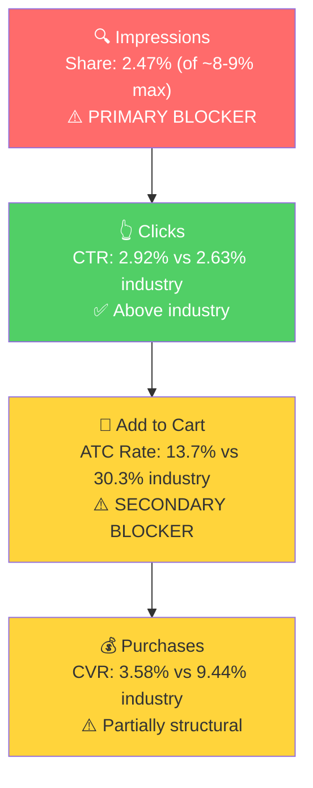

# SQP Analysis - The Restroom Kit (P0)

## Tagging Rationale

- **Tier 1 (Hero):** Queries where the customer is searching for portable or travel toilet paper. "Travel toilet paper" is the dominant keyword (745 lifetime cart adds, 153 purchases). The product is the direct answer: an all-in-one hygiene kit that includes toilet paper plus seat cover and wipes. Queries: travel toilet paper, travel toilet paper to go packs, portable toilet paper, toilet paper travel, portable toilet paper for travel, travel size toilet paper, on the go toilet paper, toilet paper to go

- **Tier 2 (Core market):** Queries for travel restroom kits, bathroom kits, and disposable toilet seat covers. The product is a natural fit here. These are lower volume individually but highly relevant. Queries: travel toilet seat covers, toilet seat covers disposable flushable, travel toilet kit, travel bathroom kit, public bathroom kit, public restroom kit, emergency bathroom kit, disposable toilet seat cover

- **Tier 3 (Adjacent):** Very broad queries (purse essentials, toilet seat cover, travel size toiletries) with enormous volume (~1M/mo). The product can appear but is not the primary intent for the vast majority of searchers. Not realistically capturable with the current product. Queries: purse essentials, toilet seat cover, travel size toiletries

**Catalog overlap check:** Only one active product (B0G4SBYV11) with pack size variations under a single listing. Adjusted impression share cap: ~8-9% (default, 1 product ranking).

## Market Sizing

12-month averages (Apr 2025 - Mar 2026):

| Tier | Monthly Search Volume | Monthly Add to Carts (Market) | Monthly Purchases (Market) | Est. Market Size ($/mo) |
|------|----------------------|-------------------------------|---------------------------|------------------------|
| Tier 1 | ~25,000 | ~5,100 | ~1,725 | ~$143,000 |
| Tier 2 | ~26,800 | ~6,500 | ~2,100 | ~$182,000 |
| Tier 3 | ~1,044,000 | ~186,300 | ~56,000 | ~$5.2M |
| **Total P0 (T1+T2 capturable)** | **~51,800** | **~11,600** | **~3,825** | **~$325,000** |

*Estimated using $28 avg product price based on hero child (12-pack) pricing.*

Tier 3 is excluded from the capturable total. These queries are 20-40x the volume of Tier 1/2 but the product has near-zero share and the intent is too broad. The realistic addressable market for P0 is ~$325K/mo across Tier 1 and Tier 2 combined.

**Seasonality:** Tier 1 search volume shows moderate seasonality: higher in spring/summer (May: 31K, Sep: 29K) and lower in winter (Nov: 18K, Dec: 17K). This aligns with travel season patterns but the variation is modest (~1.7x peak-to-trough), not a dramatic seasonal product.

## Market Share and Potential

3-month window (Jan - Mar 2026):

| Tier | Impression Share | Click Share | Cart Share | Purchase Share | Trend |
|------|-----------------|-------------|------------|---------------|-------|
| Tier 1 | 2.47% | 2.75% | 1.24% | 1.04% | Stable |
| Tier 2 | 0.86% | 0.62% | 0.16% | 0.20% | Stable |
| Tier 3 | 0.007% | 0.01% | ~0% | ~0% | N/A |

The brand captures just over 1% of purchases on Tier 1 queries and 0.2% on Tier 2 queries. Given the impression share cap of ~8-9%, there is significant room to grow on both tiers.

**Notable share funnel pattern (Tier 1):** Click share (2.75%) is higher than impression share (2.47%), meaning CTR is above industry. But cart share (1.24%) and purchase share (1.04%) drop off sharply, meaning the funnel leaks at the Add-to-Cart and Purchase stages. This is partially explained by price/intent mismatch: searchers on "travel toilet paper" queries may expect a $5-10 pack of portable toilet paper, not a $28 all-in-one hygiene kit. The brand still converts profitably on these queries (153 lifetime purchases on "travel toilet paper" alone), but it will never match industry CVR because a portion of this traffic is structurally mismatched.

## Blockers & Growth Path

Volume-weighted brand vs industry rates (3-month window, Jan-Mar 2026):

| Tier | Impression Share | CTR (Brand vs Industry) | ATC Rate (Brand vs Industry) | CVR (Brand vs Industry) | Primary Blocker | Growth Path |
|------|-----------------|------------------------|------------------------------|------------------------|-----------------|-------------|
| Tier 1 | 2.47% (of ~8-9% max) | 2.92% vs 2.63% (Healthy) | 13.7% vs 30.3% (Below) | 3.58% vs 9.44% (Below) | Impression Share | PPC scaling: The brand converts on these queries (above-industry CTR, 153 lifetime purchases on the hero keyword). Impression share is far below the ~8-9% cap. Bid on Tier 1 keywords to increase visibility. The CVR gap is partially structural (price/intent mismatch) and should not prevent scaling. |
| Tier 2 | 0.86% (of ~8-9% max) | 1.92% vs 2.67% (Below) | 11.1% vs 42.3% (Below) | 3.97% vs 12.41% (Below) | Impression Share | PPC scaling: The brand is nearly invisible on highly relevant restroom kit and seat cover queries. These have stronger intent match than Tier 1. Launch campaigns targeting these keywords. |
| Tier 3 | 0.007% | N/A | N/A | N/A | Not capturable | Skip. Intent too broad, product is not what these searchers want. |

**ICAP Funnel - Tier 1 (highest growth opportunity):**

**Key observations:**

- The brand's impression share on Tier 1 (2.47%) represents ~$1,490/mo in purchases (1.04% of ~$143K market). At the impression share cap (~8-9%), holding the same click and conversion rates, the brand could capture ~$4,800-5,400/mo from Tier 1 alone. That is ~3.5x the current capture.
- The ATC/CVR gap on both tiers is notable but partially explained by the product's premium positioning ($28 all-in-one kit vs. $5-10 simple travel toilet paper packs). This is not a listing quality issue; the listing is strong. It is a structural price/intent gap that will persist on some queries but is acceptable because the product's margin supports a lower conversion rate at higher AOV.
- Tier 2 represents the bigger missed opportunity per impression because the queries ("travel toilet kit," "public restroom kit," "emergency bathroom kit") have stronger intent match with an all-in-one hygiene kit. The brand is essentially invisible here (0.86% impression share).

## Insights

- P0 (Restroom Kit 12-Pack) has a capturable market of ~$325K/mo across Tier 1 and Tier 2. The brand currently captures roughly $2K/mo (under 1% of the addressable market). The gap is primarily a visibility problem, not a product or listing problem.
- "Travel toilet paper" is the single most important keyword for this brand. It drives the vast majority of non-branded conversions (745 lifetime cart adds, 153 purchases). Any PPC strategy should anchor on this query first.
- The brand has above-industry CTR on Tier 1, meaning the main image and title are effective at getting clicks when the product appears. The listing wins the search results page battle. The funnel drops at ATC/CVR, but this is partially structural (price premium) and the brand still converts profitably.

## Things to Investigate Further

- Check in ad data whether the seller was bidding on "travel toilet paper" and other Tier 1/Tier 2 keywords during the Jan-Mar 2026 ad period. If the $2,251 in ad spend was going to irrelevant terms, that explains both the poor ROAS and the failed ad experiment.
- Tier 2 queries ("travel toilet kit," "public restroom kit") have near-zero brand presence. Verify whether any ad spend went to these terms at all.

## Questions for the Seller
