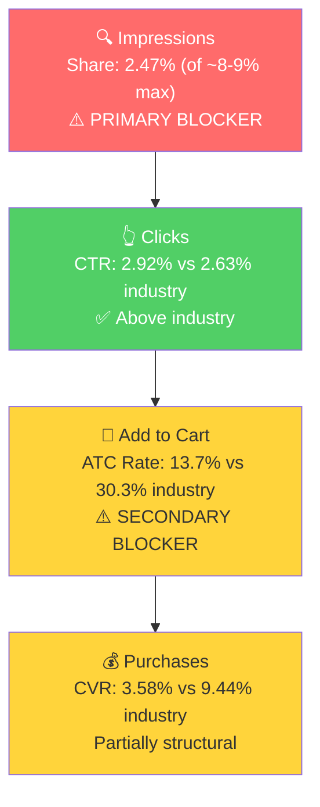

# Seller Central Audit - The Restroom Kit

## Section 1: Catalog Assessment

| Priority | Product | 3-Mo Sales | 3-Mo Ad Spend | ROAS | TACoS | Organic Sales | Ad Sales % | Buy Box % | CVR | Trend |
|----------|---------|-----------|--------------|------|-------|---------------|-----------|-----------|-----|-------|
| P0 | Restroom Kit (12-pack hero, multi-pack variations) | $24,020 | $2,251 | 2.06 | 9.4% | $19,389 (80.7%) | 19.3% | 99.9% | 6.1% | Declining |

This is a single-product brand. The second parent (B09KP1LYBF, "Restroom Kit Blue Toiletry Bag") generated $38 in total sales over 3 months with single-digit sessions. It is effectively dead and not worth analyzing.

P0 has 5 active children: 12-Pack Blue (68% of sales), 30-Pack (13%), Women's Plus 12-Pack (9%), 3-Pack (7%), 60-Pack (3%). The 12-Pack (B079LX5T6R) is the hero child.

**Key context:** The brand ran with zero ad spend from at least April 2025 through December 2025, generating $7-10K/month purely organically. Advertising started in January 2026, ran for ~10 weeks with poor results (2.06 ROAS, ~47% ACoS), and was abandoned by mid-March. The campaigns were managed by AsteroidX/Amazify automation.

## Section 2: Qualitative Product Understanding (P0)

**Product:**
- A portable, individually sealed, all-in-one restroom hygiene kit containing a patented oversized toilet seat cover, 3 feet of 3-ply toilet paper, a flushable tush wipe, and a hand wipe
- Key differentiator: the seat cover is patented (US Patent 7,774,869 B2), oversized for full coverage with a rear pocket for stability. No competitor replicates the exact all-in-one bundled format
- Solves the problem of using dirty, under-supplied public restrooms with one compact, sealed packet
- Purchase motivation: peace of mind and hygiene protection when using public or portable toilets

**Customer:**
- Primary: Parents with school-age children, women who want hygiene assurance in public restrooms
- Secondary: Travelers, outdoor enthusiasts, caregivers for elderly
- Purchase driver: germaphobia / hygiene anxiety around public restrooms

**Brand:**
- The Restroom Kit is a registered brand, manufactured by TimeAway LLC
- Amazon-primary with a website (TheRestroomKit.com) but limited DTC or retail distribution
- Established niche brand, selling on Amazon since at least 2018. Multiple pack sizes and a women's variant indicate product line development over time
- Patented product with real IP protection
- Brand vibe: clean, approachable, slightly humorous ("Protect Your Bottom" shield logo). Blue and orange color scheme. Practical and family-friendly

**Competitive Landscape:**
- Price positioning: Avg comparable 12-pack: ~$25-30 | P0: ~$28 | Positioned mid-market
- The category is niche. Few competitors offer the exact same all-in-one format

| Competitor | Product | Price Range | Key Difference |
|-----------|---------|-------------|----------------|
| Potty Shields | Disposable toilet seat covers only | $8-15 for 20-pack | No paper/wipes, just covers |
| POTTY PACK | Travel toilet kits with compressed towels | $12-20 for 10-pack | Similar concept, different components |
| Public Restroom Kit | Portable hygiene kits | $15-25 for multi-packs | Similar concept, less established |
| Generic seat cover brands | Standard disposable seat covers | $5-12 for bulk packs | Commodity, no differentiation |

**Listing Quality:**

**Strengths:**
- Rating: 4.7 stars from 292 reviews (82% 5-star, 0% 2-star). Excellent trust signal
- Images: 9 images including lifestyle shots (purse portability, child's backpack, seat cover demo)
- A+ Content: 3 image-based modules showing value prop, kit contents, and 3-step usage guide. Well-designed
- Videos: 2 (1 brand, 1 influencer)
- Brand Store present, Subscribe & Save enabled
- 5 bullets with all-caps headers, covering protection, portability, gifting, biodegradability, and patented design

**Opportunities:**
- Title: "Great for travel" is informal and wastes title real estate. Missing high-volume search terms like "public restroom" and "for kids." Suggested revision: "The Restroom Kit (12-Pack) Disposable Toilet Seat Covers for Public Restrooms, Portable Travel Kit with Oversized Seat Cover, Toilet Paper & Flushable Wipes, for Kids, Adults & Elderly"
- Bullet 3 (PERFECT GIFT): 181 characters spent on "Holidays, Camping, Hiking, Stocking Stuffers, BBQs." Reads as keyword stuffing. Replace with a bullet addressing the kids/school use case or the patented seat cover advantage
- Videos are both under 30 seconds. A longer demo video (45-60s) showing the full open-to-use experience would better demonstrate the product's ease of use

## Section 3: Quantitative Product Understanding (P0)

**Annual Trend:**

| Metric | Jul 2025 | Oct 2025 | Jan 2026 | Mar 2026 |
|--------|----------|----------|----------|----------|
| Total Sales | $9,635 | $9,920 | $9,047 | $7,453 |
| Sessions | 3,989 | 6,221 | 5,800 | 4,223 |
| CVR | 8.20% | 5.38% | 5.69% | 6.25% |
| Buy Box % | 99.29% | 99.98% | 99.91% | 99.94% |

- The brand has maintained $7-10K/mo in sales for over a year with zero advertising (Apr-Dec 2025). This demonstrates strong organic product-market fit. The product sells itself.
- Sessions spiked in Q4 2025 (Oct: 6,221) and stayed elevated into Jan 2026 (5,800), likely driven by holiday travel and the start of ad campaigns. Sessions have since returned to the ~4,200 baseline.

**Rating Trajectory:** Stable at 4.7. No concerning trends.

**Sales Rank Trajectory:** Stable. #193-214 in Toilet Paper subcategory, ~80,000-90,000 in Health & Household.

## Section 4: Market Opportunity (SQP)

**Tier Breakdown:**

- **Tier 1 (Hero):**
  - **Keywords:** travel toilet paper, travel toilet paper to go packs, portable toilet paper, toilet paper travel, portable toilet paper for travel, travel size toilet paper, on the go toilet paper, toilet paper to go
  - **Rationale:** Queries where the customer is searching for portable/travel toilet paper. "Travel toilet paper" is the dominant keyword (745 lifetime cart adds, 153 purchases). The product is the direct answer to the search.

- **Tier 2 (Core market):**
  - **Keywords:** travel toilet seat covers, toilet seat covers disposable flushable, travel toilet kit, travel bathroom kit, public bathroom kit, public restroom kit, emergency bathroom kit, disposable toilet seat cover
  - **Rationale:** Queries for travel restroom kits and disposable toilet seat covers. The product is a natural fit. These have stronger intent match with an all-in-one hygiene kit than Tier 1's "toilet paper" focus.

- **Tier 3 (Adjacent):**
  - **Keywords:** purse essentials, toilet seat cover, travel size toiletries
  - **Rationale:** Very broad queries (~1M/mo combined) where the product can appear but is not the primary intent. Not capturable with the current product.

**Market Sizing:**

| Tier | Monthly Search Volume | Monthly Add to Carts (Market) | Monthly Purchases (Market) | Est. Market Size ($/mo) |
|------|----------------------|-------------------------------|---------------------------|------------------------|
| Tier 1 | ~25,000 | ~5,100 | ~1,725 | ~$143,000 |
| Tier 2 | ~26,800 | ~6,500 | ~2,100 | ~$182,000 |
| Tier 3 | ~1,044,000 | ~186,300 | ~56,000 | ~$5.2M (not capturable) |
| **Total P0 (T1+T2)** | **~51,800** | **~11,600** | **~3,825** | **~$325,000** |

*Estimated using $28 avg product price based on hero child (12-pack) pricing.*

**Blockers & Growth Path:**

| Tier | Impression Share | CTR (Brand vs Industry) | CVR (Brand vs Industry) | Primary Blocker | Growth Path |
|------|-----------------|------------------------|------------------------|-----------------|-------------|
| Tier 1 | 2.47% (of ~8-9% max) | 2.92% vs 2.63% (Healthy) | 3.58% vs 9.44% (Below) | Impression Share | PPC scaling: The brand converts on these queries (above-industry CTR). Impression share is far below cap. Scale with manual campaigns targeting proven keywords. CVR gap is partially structural (price/intent mismatch, not fixable). |
| Tier 2 | 0.86% (of ~8-9% max) | 1.92% vs 2.67% (Below) | 3.97% vs 12.41% (Below) | Impression Share | PPC scaling: The brand is nearly invisible on highly relevant kit queries. Launch campaigns targeting these keywords. |
| Tier 3 | 0.007% | N/A | N/A | Not capturable | Skip. |

**ICAP Funnel Visual (Tier 1):**

- The brand currently captures ~1% purchase share on Tier 1 and ~0.2% on Tier 2. With a capturable market of ~$325K/mo, the brand is generating ~$2K/mo from these queries. Closing the impression share gap alone (from 2.5% to 5-6%) could double the brand's SQP-attributable revenue.
- CTR is above industry on Tier 1, meaning the listing wins the click on the search results page. The funnel drops at ATC/CVR, but this is partially because a $28 all-in-one kit is a different value proposition than simple $5-10 travel toilet paper packs. This is structural and acceptable because the brand still converts profitably.

## Section 5: Ad Analysis

### Account Level

**Campaign Structure**

**Finding: Overstuffed manual campaign with budget starvation**

**Problem:**
- The primary manual campaign ("[AsteroidX] 1001 $ B079LX5T6R $ REMA") has 20 targets in one campaign
- Only 3 of 20 targets spend meaningfully. "Travel toilet seat covers" consumes 62% of the campaign budget ($335 of $542), starving high-ROAS keywords

**Solution:** Restructure into 3-5 keyword campaigns. Separate high-ROAS converters ("travel toilet paper to go packs" at 4.24 ROAS) from lower-ROAS terms ("travel toilet seat covers" at 1.74 ROAS).

**Impact:** +$605 in sales from the same spend by giving high-ROAS keywords their own budget (swap spend levels between the 1.74 ROAS and 4.24 ROAS terms).

**Auto vs Manual Split**

| Targeting Type | Clicks | Spend | Sales | ROAS | AOV | CPC | CVR |
|----------------|--------|-------|-------|------|-----|-----|-----|
| Automatic | 1,734 | $1,535 | $2,930 | 1.91 | $27.57 | $0.89 | 6.0% |
| Manual | 1,017 | $716 | $1,702 | 2.38 | $28.39 | $0.70 | 7.1% |

**Finding: Auto-heavy account (68% of spend)**

**Problem:** Auto consumes 68% of total spend at 1.91 ROAS while manual achieves 2.38 ROAS with lower CPC ($0.70 vs $0.89). The winning search terms in auto have never been harvested into manual campaigns with dedicated budgets.

**Solution:** Harvest top-converting auto search terms into manual exact campaigns. Negate harvested terms from auto to prevent spend duplication.

**Impact:** Manual campaigns achieve 24% better ROAS (2.38 vs 1.91). Moving top auto terms to manual should improve overall ROAS while increasing total sales.

**Campaign Profitability**

| Campaign | Spend | Sales | ROAS | Clicks | Orders |
|----------|-------|-------|------|--------|--------|
| Amazify Auto (Travel Kit) | $33.64 | $11.99 | 0.36 | 45 | 1 |
| Campaign with presets (3-Pack) | $48.92 | $27.99 | 0.57 | 33 | 1 |
| Business Customers Test | $11.81 | $0.00 | 0.00 | 15 | 0 |
| **Total wasted** | **$94.37** | | | | |

$94 wasted on 3 unprofitable campaigns. Small absolute number, but in the context of a $2,251 total spend (4.2% wasted), it matters.

**Targeting Strategy**

**Keyword vs Product Targeting:**

| Targeting Strategy | Clicks | Spend | Sales | ROAS | AOV | CPC | CVR |
|-------------------|--------|-------|-------|------|-----|-----|-----|
| Keyword Targeting | 2,659 | $2,216 | $4,564 | 2.06 | $27.73 | $0.83 | 6.2% |
| Product Targeting | 92 | $35 | $68 | 1.95 | $22.66 | $0.38 | 3.3% |

Keyword targeting dominates at 98% of spend. Reasonable for this product type.

**Match Type Breakdown:**

| Match Type | Clicks | Spend | Sales | ROAS | AOV | CPC | CVR |
|------------|--------|-------|-------|------|-----|-----|-----|
| EXACT | 834 | $604 | $1,438 | 2.38 | $27.39 | $0.72 | 6.5% |
| PHRASE | 81 | $60 | $168 | 2.80 | $27.99 | $0.74 | 7.4% |
| BROAD | 33 | $49 | $28 | 0.57 | $27.99 | $1.48 | 3.0% |

Exact and Phrase perform well. Broad is losing money at 0.57 ROAS and $1.48 CPC. The broad campaign should be paused or heavily negated.

### Product Level (P0)

**P0 Campaign Map**

| Campaign | Spend | Sales | ROAS | Clicks | Orders |
|----------|-------|-------|------|--------|--------|
| Auto (12-Pack) | $1,501 | $2,918 | 1.94 | 1,704 | 103 |
| REMA Manual (12-Pack) | $542 | $1,292 | 2.38 | 807 | 48 |
| SP-PH Research (12-Pack) | $60 | $168 | 2.80 | 81 | 6 |
| REMA Manual (3-Pack) | $39 | $191 | 4.85 | 41 | 7 |
| Others (5 campaigns) | $109 | $63 | 0.58 | 118 | 4 |
| **Total P0** | **$2,251** | **$4,632** | **2.06** | **2,751** | **168** |

Total P0 ad spend = 100% of total account ad spend.

**Impression Share Blocker: Keyword Spend vs. Tier 1/2 Queries**

SQP identified impression share as the primary blocker on Tier 1 (2.47% of ~8-9% max) and Tier 2 (0.86% of ~8-9% max). The PPC lever is bidding on the keywords where impression share is low. Here's what the ad data shows:

| Search Term | Tier | Spend | Sales | ROAS | Clicks | Orders | CVR |
|-------------|------|-------|-------|------|--------|--------|-----|
| travel toilet paper to go packs | Tier 1 | $94 | $334 | 3.55 | 182 | 13 | 7.1% |
| travel toilet paper | Tier 1 | $116 | $169 | 1.46 | 127 | 5 | 3.9% |
| travel size toilet paper | Tier 1 | $67 | $165 | 2.46 | 104 | 7 | 6.7% |
| compact toilet paper | Tier 1 | $32 | $139 | 4.36 | 31 | 4 | 12.9% |
| travel toilet seat covers | Tier 2 | $300 | $445 | 1.48 | 342 | 16 | 4.7% |

**Problem:**
- "Travel toilet seat covers" alone consumed $300 at a poor 1.48 ROAS, more than any Tier 1 keyword
- High-ROAS keywords are underfunded: "compact toilet paper" (4.36 ROAS, $32 spend), "travel toilet paper to go packs" (3.55 ROAS, $94 spend)
- Tier 2 keywords beyond "travel toilet seat covers" received zero ad spend: "travel toilet kit," "public bathroom kit," "emergency bathroom kit," "public restroom kit" are completely absent from the search term report
- The auto campaign consumed $1,501 in undirected spending while these specific, high-intent keywords were starved

**Solution:**
1. Launch a Tier 1 manual exact campaign: "travel toilet paper to go packs," "travel size toilet paper," "compact toilet paper" (proven converters, 2.46-4.36 ROAS)
2. Launch a Tier 2 manual exact campaign: "travel toilet kit," "public bathroom kit," "emergency bathroom kit," "public restroom kit" (untapped, highly relevant)
3. Reduce "travel toilet seat covers" to its own campaign with a capped budget
4. Scale auto campaign down to discovery-only with a $5-10/day budget

**CTR/CVR Blocker: Placement Distribution**

| Placement | Spend | Sales | ROAS | CTR | CVR | Spend Share |
|-----------|-------|-------|------|-----|-----|-------------|
| Top of Search | $395 | $1,394 | **3.53** | **9.25%** | **12.1%** | 17.5% |
| Rest of Search | $1,115 | $2,028 | 1.82 | 1.09% | 5.2% | 49.5% |
| Product Pages | $738 | $1,210 | 1.64 | 0.86% | 5.0% | 32.8% |

**Finding: Top of Search dramatically outperforms but gets only 17.5% of spend**

**Problem:** Top of Search achieves 3.53 ROAS and 12.1% CVR, nearly 2x better than other placements. Yet only 17.5% of spend goes there. The AsteroidX automation did not set Top of Search bid modifiers.

**Solution:** Set Top of Search bid modifier to 50-100% on all manual campaigns. This shifts impressions toward the premium placement where the listing converts best.

**Impact:** Shifting to a 30/35/35 TOS/ROS/PP spend split would generate ~$476 in additional sales from the same $2,251 total spend, improving ROAS from 2.06 to 2.27.

## Section 6: Action Plan

The primary blocker is impression share: the brand barely shows up on the search queries where it sells. The seller's first ad attempt failed because of poor campaign structure (auto-heavy, overstuffed manual campaigns, no Top of Search modifiers), not because the product doesn't respond to advertising. This plan rebuilds the ad account from scratch with proper structure.

### Weeks 1-2: Immediate Actions

**PPC Foundation (addressing impression share blocker):**
- Launch Tier 1 manual exact campaign with 4 proven keywords: "travel toilet paper to go packs" (3.55 ROAS), "travel size toilet paper" (2.46 ROAS), "compact toilet paper" (4.36 ROAS), "toilet paper travel" (high lifetime conversions in SQP). Budget: $20/day
- Launch Tier 2 manual exact campaign with 4 untapped keywords: "travel toilet kit," "public bathroom kit," "emergency bathroom kit," "public restroom kit." Budget: $15/day
- Set Top of Search bid modifier at 50% on both campaigns
- Launch a small auto campaign for discovery at $5/day, with all known converting terms negated (forces Amazon to find new terms)
- Launch a branded defense campaign on "the restroom kit" and "restroom kit" at $2-3/day (branded search volume exists and should be protected)

**Quick Wins:**
- Negate broad match campaign (0.57 ROAS, $1.48 CPC) and reallocate budget
- Negate non-converting search terms from auto: "travel size," "mini travel essentials," "purse essentials," "travel" (combined $42 in wasted spend)

### Weeks 2-4: Short-Term Optimizations

- Harvest converting search terms from auto campaign into manual exact campaigns
- Scale Tier 1 campaign budget based on Week 1-2 performance (increase daily budget on keywords with >2.5 ROAS)
- Begin listing content preparation:
  - Draft revised title with "public restroom" and "for kids" keywords
  - Draft replacement for Bullet 3 (GIFT bullet) focusing on the kids/school use case
  - Commission a 45-60s product demonstration video showing the full open-to-use experience
- Add "travel toilet paper to go packs" as a phrase match in a separate campaign to capture long-tail variations

### Weeks 4-6: Medium-Term Growth

- Publish listing improvements: updated title, revised Bullet 3, new video
- Monitor CVR impact from listing changes across all campaigns
- Introduce product targeting: target competitor ASINs (Potty Shields, POTTY PACK) with Sponsored Product ads. These customers are looking for the same solution
- Scale the Tier 2 campaign based on performance data. If "public bathroom kit" and "emergency bathroom kit" convert well, increase budget
- Evaluate adding phrase match campaigns for Tier 2 keywords to capture variations

### Weeks 6-8: Scaling and Evaluation

- Scale PPC on the improved listing. Target $40-50/day total ad spend across all campaigns (up from the $10-15/day the seller was running at toward the end)
- Monitor TACoS target: aim for 10-12% TACoS with the organic base intact. At $8K/mo organic + properly managed PPC, the target is $10-12K/mo total revenue
- Evaluate the Women's Plus variant (B0BRBX5NM8): it has 3.3% CVR vs 6.3% for the standard 12-pack. If CVR improves with the listing updates, consider dedicated campaigns. If it stays low, investigate whether the listing needs its own optimization
- Prepare for summer travel season (May-August historically shows higher search volume on Tier 1 keywords). Scale campaigns by April to capture the seasonal peak

## Section 7: Insights & Questions for the Seller

**Insights:**
- P0 (Restroom Kit 12-Pack) has proven organic product-market fit at $7-10K/mo with zero ad spend for over a year. This is the foundation for growth, not a failing business that needs saving. The opportunity is scaling a product that already works.
- The first ad experiment failed because of campaign structure, not because the product doesn't respond to ads. AsteroidX automation created an auto-heavy, overstuffed structure with no Top of Search modifiers. Top of Search achieves 3.53 ROAS and 12.1% CVR, but only received 17.5% of spend. A properly structured campaign would have delivered significantly better results.
- The capturable market for P0 is ~$325K/mo across Tier 1 and Tier 2 keywords. The brand currently captures ~1% of this market. Even modest impression share gains (from 2.5% to 5-6%) could double the brand's search-attributable revenue.
- P0 (Restroom Kit 12-Pack) has a patented, differentiated product with no direct competitor replicating the exact all-in-one format. This IP moat, combined with a 4.7-star rating from 292 reviews, gives the brand a durable competitive advantage.

**Questions for the Seller:**
- You started running ads in January 2026 and stopped by mid-March. Was this pulled due to poor ROAS, budget constraints, or frustration with the AsteroidX tool? Understanding your experience helps us set expectations for what properly managed campaigns can achieve.
- The Women's Plus variant (Pink, 12 Count) has notably lower CVR (3.3% vs 6.3% for the standard 12-pack) despite getting significant traffic. Is there anything different about this product (different customer, different price point, known listing issues) that could explain the gap?
- Are there any wholesale, B2B, or corporate channels where you sell the product (hotels, airlines, event venues)? This would inform whether a B2B Amazon strategy is worth exploring alongside the consumer campaigns.
