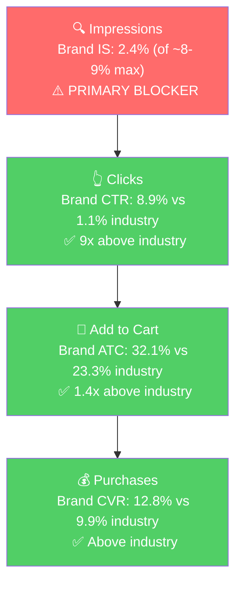

# Seller Central Audit - Tiger Taco (For the Brand)

A focused growth assessment for Tiger Taco Box Clips. The headline: there's a healthy converting product on a small keyword market, and a much larger upstream market reachable through product targeting on adjacent product detail pages.

## Section 1: Market Opportunity

Analysis window: Q1 2026 (Jan 1 - Mar 31, 2026).

**Tier Breakdown:**

- **Tier 1 (Hero - Direct Category):**
  - **Keywords:** box clips, cardboard box clips, box clip, cardboard box clip
  - **Rationale:** Generic, high-intent category descriptors. What a first-time buyer types when they don't know the brand.

- **Tier 2 (Functional Description):**
  - **Keywords:** box flap holder(s), cardboard box flap holder, carton flap holder, box flap clip(s), carton clip(s), box clips for packing, box holder clip, packing box flap holder, cardboard box corner flap holders, cardboard box flap down clips, industrial box flap holders, large box clip, box carton open clips, clips to hold box flaps down, tool meant to hold down box flaps
  - **Rationale:** The same use-case described differently. Lower volume per query but high relevance and very strong conversion when the brand appears.

- **Tier 3 (Adjacent / Upstream Demand - The Real Growth Tier):**
  - **Targets:** Top-selling moving box ASINs, packing tape, bubble wrap, packing paper, moving labels, shipping/storage boxes, box cutters, shrink wrap, moving supply kits/bundles. These are the product detail pages of the supplies a shopper buys when they are about to pack or move.
  - **Rationale:** Shoppers searching "moving boxes," "moving supplies," "shipping boxes," "cardboard boxes" want the box itself, not an accessory. Keyword targeting on these queries does not work (industry CVR ~0% for accessory products on these queries). But the same shoppers, once they land on a moving-box or packing-supply detail page, are in active packing-or-moving mode. That's exactly when a flap clip becomes a logical add-on. **The play here is product targeting on adjacent PDPs, not keyword targeting on adjacent search queries.**

- **Branded:**
  - **Keywords:** tiger taco / tiger tacos / tiger taco box clips + long-tail variants, plus the "taco" derivative terms (taco clip, taco clips, box taco, box tacos, taco box holder, etc.) that originated from the brand.
  - **Rationale:** "Taco" terminology was coined by Tiger Taco. Treating it as branded captures the full brand-defense scope, including the queries competitors are colonizing.

**Market Sizing:**

| Tier | Q1 Search Volume | Q1 Market Purchases | Est. Q1 Market Size ($) | Est. Annual Market Size ($) |
|------|------------------|--------------------|------------------------|----------------------------|
| Tier 1 | 1,234 | 38 | $209 | ~$835 |
| Tier 2 | 625 | 49 | $270 | ~$1,080 |
| Branded | 761 | 67 | $369 | ~$1,475 |
| **Tier 3 (Adjacent PDPs)** | **~700,000\*** | **~30,000\*** | **~$165,000** | **~$660,000** |
| **Total Reachable Market** | **~702,620** | **~30,154** | **~$165,847** | **~$663,390** |

*Tier 3 figures are a directional estimate of aggregate demand across moving-box, packing-tape, bubble-wrap, shipping-box, and packing-supply ASINs that Tiger Taco can target with product targeting ads. Actual capture depends on attach rate and bid competitiveness, which the launch phase will measure.*

**Tier 3 is roughly 200x the size of Tiers 1 + 2 + Branded combined.** That is the meaningful growth opportunity. Tiers 1 and 2 are about capturing existing intent-to-buy-flap-clips; Tier 3 is about creating that intent in the moment a shopper is buying boxes.

**Brand Performance vs Industry (Q1 2026):**

| Tier | Brand Impr Share | Brand CTR | Industry CTR | Brand CVR | Industry CVR | Brand Purchase Share |
|------|-----------------|-----------|--------------|-----------|--------------|---------------------|
| Tier 1 | 2.4% | 8.9% | 1.1% (9x lower) | 12.8% | 9.9% | 26% |
| Tier 2 | 2.8% | 22.8% | 2.2% (10x lower) | 28.7% | 14.0% (2x lower) | 59% |
| Branded | 3.3% | varies (high on direct brand) | varies | varies (high) | varies | high on direct brand |
| Tier 3 | not yet tested (no ads ever run) | TBD | TBD | TBD | TBD | TBD |

The pattern on Tiers 1 and 2 is clear: **the brand wins the click and the cart way more than its visibility justifies.** Tiger Taco gets 26% of all purchases on "box clips" with only 2.4% of impressions - meaning when a shopper sees the listing, they choose it 9 times more often than the average competitor.

**Blockers and Growth Path:**

| Tier | Primary Blocker | Growth Path |
|------|-----------------|-------------|
| Tier 1 | Impression Share (2.4% of ~8-9% cap) | Sponsored Products on the 4 Tier 1 keywords. Funnel below impressions is healthy. |
| Tier 2 | Impression Share (2.8% of ~8-9% cap) | Sponsored Products on top Tier 2 keywords. Best CVR in the catalog. |
| Tier 3 | No ads running anywhere yet | Product Targeting (PAT + Sponsored Display) on adjacent moving / packing / shipping PDPs. Primary growth lever. |
| Branded | No defense ads running. Brand impression share on its own name is only 3.3%. | Branded defense campaign + Sponsored Brands header to own brand-name SERPs. |

**ICAP Funnel - Tier 1 (Illustrative of Tier 1/2 dynamics):**

The brand wins every stage below impressions. It just doesn't show up enough.

**SQP Notes:**

- "Taco" terminology has been semi-genericized. Queries originated by Tiger Taco (taco clip, box taco, etc.) now show competitor products. With no defense ads running, competitors capture share on the brand's own coined terms.
- "box clips" search volume grew ~80% from Q2 2025 (443) to Q1 2026 (801). Whether this is true demand growth or seasonality cannot be confirmed without 2-year history. Worth monitoring.
- The Tier 3 opportunity is the structural growth story. Tiers 1 and 2 will become reliable revenue but plateau at the impression-share cap quickly.

## Section 2: Growth Levers

Four levers, in order of revenue impact:

### Lever 1: Product Targeting on Tier 3 (Primary Growth)

Sponsored Products PAT and Sponsored Display product targeting on adjacent product detail pages where shoppers are actively packing or moving:

- Top-selling moving box ASINs (small/medium/large)
- Packing tape and tape dispensers
- Bubble wrap, packing paper
- Moving labels, markers, shipping supplies
- Box cutters, shrink wrap, packing knives
- Moving supply kits and bundles
- Storage box ASINs

Why this works where keyword targeting doesn't: the shopper has already committed to the project. They are buying boxes and tape. Tiger Taco is a complementary purchase, not a substitute. The "people also bought" surface is where complementary accessories convert at meaningfully higher rates than generic search ads. Each placement competes against other accessories, not against actual boxes.

This is the lever with the largest ceiling. The audit will iterate on which specific ASIN targets convert best, but the addressable market is in the millions of monthly purchases upstream of Tiger Taco's niche.

### Lever 2: Sponsored Products on Tier 1 and Tier 2 Keywords (Capturing Existing Intent)

Manual exact campaigns on:
- Tier 1: box clips, cardboard box clips, box clip, cardboard box clip
- Tier 2: box flap holder, box flap holders, cardboard box flap holder, box flap clips, box clips for packing, carton clips (top 6 by volume)

The brand already wins clicks and conversions when it shows up. Bidding here closes the impression-share gap (currently 2.4% / 2.8% vs the ~8-9% cap). This is profitable, deterministic visibility on the queries with proven intent. The absolute revenue impact is small ($2-3K/year incremental), but every dollar spent here will convert because the funnel is healthy.

### Lever 3: Branded Defense (Protective)

Small Sponsored Products campaign (3-5% of total ad budget) on:
- "tiger taco," "tiger tacos," "tiger taco box clips"
- Top "taco clip / box taco" derivatives the brand effectively coined

Plus a Sponsored Brands header ad on those branded SERPs.

Purpose: prevent competitors from poaching brand-name searches. Currently the brand has only 3.3% impression share on its own name because there's no defense running. This isn't growth, it's protection.

### Lever 4: Listing Improvements (Compounding Lever)

The listing has all the infrastructure (A+ Content, video, brand store) but isn't fully optimized. The highest-impact fixes:

- **Main image:** Currently shows clips in isolation. Replace with a close-up of the clip in use on a box edge, plus a "Fits Single & Double Walled Boxes" badge. Use-case clarity drives CTR on the SERP.
- **A+ Content:** Currently 207 words across 2 modules (text-heavy). 2026 best practice is image-led with text overlaid. Add 3 more modules, image-first.
- **Bullets:** Currently 405 characters across 5 bullets. Industry benchmark is 800-1,200. Expand with keyword integration and benefit content.
- **Video:** Both videos under 30 seconds. Add a 30-60 second demo of the clip in real packing/unpacking workflow.
- **Coupon:** The brand has never used a coupon. A 5% off badge on the SERP is a free CTR lever.

This lever matters most when Tier 3 traffic starts arriving. Shoppers landing on the Tiger Taco PDP from a moving-box ad have not searched "box clips" - they were looking at boxes. The listing has to do more work to convert them. A sharper listing protects CVR as ad traffic shifts toward less-direct intent.

## Section 3: Action Plan

### Weeks 1-2: Launch Ads (All Surfaces)

- **Sponsored Products PAT on Tier 3 PDPs ($5-7/day):** Bid on the top 20-30 ASINs across moving boxes, packing tape, bubble wrap, packing paper, moving labels, shrink wrap, box cutters. Suggested bid + 20% to test placement performance. **Primary growth surface.**
- **Sponsored Display Product Targeting ($3-5/day):** Same target ASIN list as PAT, on the Sponsored Display surface (carousels and "people also bought" placements).
- **Sponsored Products Manual Exact - Tier 1 ($3-4/day):** box clips, cardboard box clips, box clip, cardboard box clip. Suggested bid + 20%.
- **Sponsored Products Manual Exact - Tier 2 ($3-4/day):** Top 6 Tier 2 keywords (box flap holder, box flap holders, cardboard box flap holder, box flap clips, box clips for packing, carton clips). Suggested bid + 30%.
- **Sponsored Products Auto Campaign ($5-7/day):** Search-term harvest. Surfaces queries Amazon thinks the listing is relevant for, including ones not yet tagged.
- **Branded Defense Campaign ($1-2/day, 3-5% of total ad spend):** Sponsored Products exact match on "tiger taco" + "taco clip / box taco" derivatives.
- **Top of Search modifier:** +50% on all manual keyword campaigns.

### Weeks 3-6: Listing Improvements

Tier 3 traffic will land on the PDP without the direct intent of a "box clips" searcher. CVR will compress unless the listing communicates the use case clearly. This window publishes the listing fixes before that traffic builds momentum.

- **Week 3:** Begin drafts of new main image, A+ modules, expanded bullets, demo video.
- **Week 4:** Publish the new main image and coupon (fastest, highest CTR impact). Continue A+ / video work.
- **Week 5-6:** Publish A+ Content rebuild, expanded bullets, and the longer demo video.
- **In parallel:** Promote converting search terms from Auto into Manual campaigns. Promote converting ASIN targets from the PAT seed campaign into dedicated PAT campaigns at higher bids. Negative-target irrelevant queries flagged in Auto.
- **Begin a review-velocity push:** Use Vine (if eligible) and the Request a Review button on every order. Review momentum matters as paid traffic increases ranking pressure.

### Week 6+: Re-Audit and Iterate

The audit gets re-run on the same SQP and ad data to measure what moved and where to double down.

- **Tier 1 + Tier 2 impression share check:** Did keyword campaigns lift impression share toward the 8-9% cap? If yes, expand the keyword list to longer-tail Tier 2 queries. If no, raise bids or improve listing relevance.
- **Tier 3 conversion check:** Which specific ASIN targets are converting? Reallocate budget from the broad PAT campaign into dedicated PAT campaigns on the top 10-15 ASIN targets, at higher bids.
- **CVR check after listing publish:** Did the new main image / A+ / bullets lift CVR? Tier 1 brand CVR was 12.8%; the target is 18-20% with the upgraded listing.
- **Branded share check:** Has the defense campaign moved branded impression share from 3.3% closer to the cap? Are competitors still poaching "taco clip" derivatives?
- **Iterate budget mix:** Whichever surface has the strongest ROAS gets a larger share of the next budget increment. Likely outcomes: PAT and SD scale heavily; keyword campaigns plateau at the impression-share cap; listing changes compound the rest.

## Section 4: Open Questions for You and Your Partner

These are the decisions worth aligning on before / during the engagement:

- **Have you considered launching variations** (8-pack, 12-pack, heavy-duty version, different colors, complementary packing supplies)? With one ASIN, the catalog ceiling is fixed. SKU expansion is the path to materially more revenue past what ads alone can produce.
- **The product has been live since 2014. Has the listing been refreshed substantively over the years** (image redesigns, A+ rebuilds), or is the current listing largely the original setup? This sets the baseline for what "an update" should accomplish.
- **Search volume on "box clips" is up ~80% year-over-year (Q2 2025 to Q1 2026). Have you noticed any external trend driving this** (e.g., a TikTok / social moment, a new use case emerging)? Understanding the demand driver shapes whether to expect growth to continue.
- **What's the comfortable starting ad budget?** The plan assumes a launch budget of roughly $700-1,000/month split across the surfaces above. Higher budget accelerates the Tier 3 learning curve; lower budget extends it but doesn't change the strategy.
