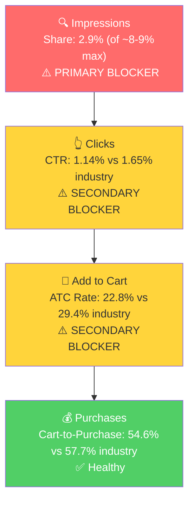

# SQP Analysis - P0: Mole Scissor Trap (YARDDOG)

## Tagging Rationale

- **Tier 1 (Hero):** Queries where the customer is searching specifically for a mole trap. The product is the direct answer. Includes "mole trap", "mole traps", "mole scissor trap", "scissor mole trap", "mole traps for lawns". (5 queries)
- **Tier 2 (Core market):** Queries for mole elimination where the product is one valid solution among several. Includes "mole killer", "mole traps that kill best", "mole traps that work best", "ground mole traps", "mole eliminator trap", "scissor traps for moles", "mole traps scissor 2 pack", "mole trap scissor", "easy mole trap", "mole traps that work", "yard mole trap". (11 queries)
- **Tier 3 (Broad/adjacent):** Adjacent pest or different solution type. "gopher trap" (different animal), "vole trap" (different animal), "mole repellent" (different solution method). The scissor trap can appear but is not the primary intent. (3 queries)
- **Branded:** "yard dog mole trap", "yarddog mole trap", "yarddog", and 5 other branded variants. (8 queries)

## Market Sizing (12-Month Averages, Mar 2025 - Feb 2026)

| Tier | Monthly Search Volume | Monthly Add to Carts (Market) | Monthly Purchases (Market) | Est. Market Size ($/mo) |
|------|----------------------|-------------------------------|---------------------------|------------------------|
| Tier 1 | 52,943 | 8,478 | 4,631 | $211,950 |
| Tier 2 | 28,906 | 5,152 | 3,107 | $128,800 |
| Tier 3 | 50,844 | 8,127 | 4,495 | $203,175 |
| **Total P0** | **132,693** | **21,757** | **12,233** | **$543,925** |

*Est. market size uses $25 avg product price (market average for mole traps across 1-packs and 2-packs).*

**Seasonality:** The SQP data confirms the same seasonal pattern seen in Step 1. Tier 1 search volume peaks at ~79K in June and troughs at ~31K in December (a 60% swing). This matches YARDDOG's own sales trajectory exactly ($23K peak in July, $3.5K trough in December). The product is market-seasonal. Revenue swings are driven by mole activity (spring/summer), not a brand-specific issue.

## Market Share and Potential (Dec 2025 - Feb 2026)

| Tier | Impression Share | Click Share | Cart Share | Purchase Share | Trend |
|------|-----------------|-------------|------------|---------------|-------|
| Tier 1 | 2.93% | 2.05% | 1.59% | 1.52% | Declining (3.6% → 2.1% in 3 months) |
| Tier 2 | 1.31% | 0.80% | 0.59% | 0.47% | Declining (1.5% → 1.0% in 3 months) |
| Tier 3 | 0.06% | 0.04% | 0.02% | 0% | Negligible |

- Share is declining across all tiers over the last 3 months. This coincides with the winter trough when market volume drops significantly. The declining share in the off-season may be partly seasonal, and the true test is whether share improves as spring demand returns and PPC is optimized.
- The drop from impression share to purchase share on Tier 1 (2.93% → 1.52%) indicates a funnel leak: the brand is showing up but not converting at the rate the market does. This points to a CTR and/or CVR gap.
- Tier 2 share is roughly half of Tier 1 share, meaning the brand has even less presence on the broader mole control queries.
- Tier 3 is effectively zero presence. These are adjacent queries where the product doesn't match the primary intent.

## Blockers & Growth Path (Dec 2025 - Feb 2026, Volume-Weighted)

| Tier | Impression Share | CTR (Brand vs Industry) | CVR (Brand vs Industry) | Primary Blocker | Growth Path |
|------|-----------------|------------------------|------------------------|-----------------|-------------|
| Tier 1 | 2.9% (of ~8-9% max) | 1.14% vs 1.65% (31% gap) | 12.4% vs 17.0% (27% gap) | Impression Share | PPC scaling + listing fix: brand converts below industry but at a workable rate. Scale impressions via PPC first, then improve CTR/CVR through listing optimization |
| Tier 2 | 1.3% (of ~8-9% max) | 1.18% vs 1.93% (39% gap) | 10.5% vs 18.5% (43% gap) | Impression Share + CVR | PPC scaling with CVR fix: very low visibility and conversion gap. Need both more impressions and better conversion to capture this tier |
| Tier 3 | 0.06% | N/A (13 clicks) | N/A (0 purchases) | Intent mismatch | Not capturable: "gopher trap" and "vole trap" are different animals; "mole repellent" is a different solution category. Skip. |

**Additional context on blockers:**

- **Tier 1:** The brand has room to roughly 3x its impression share (from 2.9% to 8-9%). CTR is 31% below industry, suggesting the main image/title/price presentation on the search results page is slightly weaker than competitors but not broken. CVR at 12.4% vs 17.0% industry is a moderate gap. The declining rating (3.8 stars) is likely contributing to both CTR (shoppers see the rating in search results) and CVR (shoppers see the review distribution on the PDP). This is a "low impression share + moderate CVR gap" pattern: scale PPC to capture more of the market, but prioritize listing improvements (especially video and bullet 5) to close the CVR gap simultaneously.

- **Tier 2:** Impression share at 1.3% means the brand is barely visible on these queries. The CVR gap is larger (43% below industry), which makes sense because these are broader queries ("mole killer", "mole traps that work best") where the shopper is comparing more options and the listing needs to be more persuasive to win the click-to-purchase battle. Growth path: bid on these keywords via PPC to increase visibility, but CVR improvements (rating, A+ content, video) need to happen in parallel to avoid wasting ad spend.

- **Tier 3:** Data is too thin to draw rate conclusions (13 clicks, 0 purchases over 3 months). The queries are adjacent but not core product intent. Not a priority.

**ATC Rate vs Cart-to-Purchase breakdown (Tier 1):**
- Brand ATC rate: 22.8% vs Industry 29.4% (22% gap) - the gap is at the click-to-cart stage
- Brand Cart-to-Purchase: 54.6% vs Industry 57.7% (close) - once in cart, conversion is healthy
- This means the drop-off is happening on the product detail page before add-to-cart, not after. The listing content, price, rating, and images are the lever, not checkout/delivery factors.

## ICAP Funnel Visual (Tier 1)

## Insights

- P0 (Mole Scissor Trap) has a total addressable market of ~$341K/month on Tier 1 + Tier 2 combined (excluding Tier 3 which is not capturable). At current purchase share (~1.5% on Tier 1, ~0.5% on Tier 2), there is significant room to grow. Even modest share gains (e.g., doubling Tier 1 purchase share to 3%) would meaningfully increase revenue.
- The funnel leak is at the top and middle: impression share is low (not showing up enough) and ATC rate is below industry (not convincing enough on the PDP). Cart-to-purchase is healthy, confirming that once a customer adds to cart, they buy. The fix is getting more eyeballs and converting more of those eyeballs to cart adds.
- Seasonality is confirmed as market-driven. The winter trough is not a YARDDOG problem but a category-wide demand cycle. The strategic opportunity is preparing now (March) so that when search volume ramps 2-3x into June-July, the brand captures a larger share of a larger pie.

## Things to Investigate Further

- Tier 1 CTR is 31% below industry. Check in ad data whether YARDDOG is bidding on Tier 1 keywords and what placements the ads are getting (Top of Search vs Product Pages). Top of Search placements have significantly higher CTR.
- Tier 2 CVR is 43% below industry. Check whether the brand is targeting any Tier 2 keywords in ad campaigns, and whether the search terms in current campaigns match Tier 1 or Tier 2 intent.
- The ATC rate gap (22.8% vs 29.4%) suggests the PDP is underperforming. Cross-reference with the listing quality findings from Step 2: the missing video, wasted bullet 5, and 3.8-star rating are likely contributors.

## Questions for the Seller

- None additional beyond Step 2.
