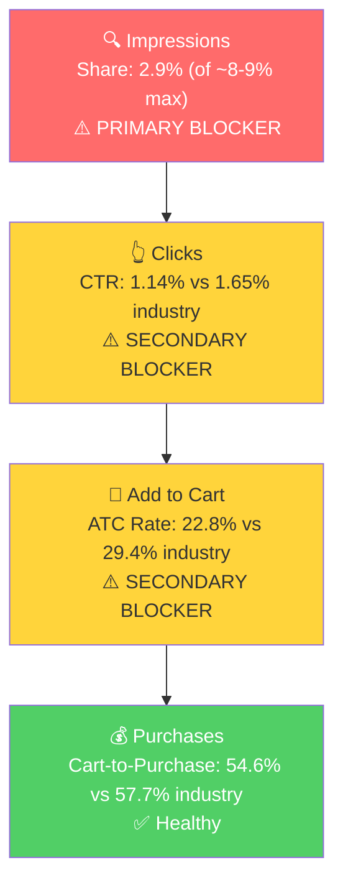

# Seller Central Audit - YARDDOG

---

## Section 1: Catalog Assessment

| Priority | Product | 3-Mo Sales | 3-Mo Ad Spend | ROAS | TACoS | Organic Sales | Ad Sales % | Buy Box % | CVR | Trend |
|----------|---------|-----------|--------------|------|-------|---------------|-----------|-----------|-----|-------|
| P0 | Mole Scissor Trap | $11,371 | $1,140 | 2.80 | 10.0% | $8,183 (72%) | 28% | 94.2% | 18.4% | Seasonal trough |
| P1 | Plunger Bite-Spike Mole Trap | $4,477 | $440 | 2.32 | 9.8% | $3,454 (77%) | 23% | 99.8% | 17.1% | Flat/Stable |

**Not prioritized:**
- Mole Scissor Trap - Single Pack: $0 sales, orphan duplicate of children already under the P0 parent. Should be consolidated or removed.
- Plunger + Scissor Mole Traps - 2 Pack: $0 sales, combo bundle with negligible traffic (3-8 sessions/month).

---

## Section 2: Qualitative Product Understanding (P0)

**Product:**
- Scissor-style mole trap with a step-to-set mechanism. No digging required. Galvanized/coated steel, 6"L x 6"W x 13"H per unit. Reusable across multiple seasons with a lifetime guarantee.
- Solves the problem of mole damage to lawns and gardens without chemicals, professional services, or complex setup. The step-to-set design makes it accessible to homeowners who aren't experienced trappers.
- Core purchase motivation: frustration with active mole damage combined with a desire for a DIY solution that works without skill or effort.

**Customer:**
- Homeowners with lawns or gardens experiencing active mole damage. Skews suburban/rural. The purchase is problem-driven and usually urgent.

**Brand:**
- YARDDOG is a legitimate registered trademark. Founded around 2021, inspired by the founder's dog Daisy.
- Multi-channel distribution: Amazon, Home Depot, Tractor Supply, Walmart, Menards. This is notably broad for a brand at this revenue level and is a strong credibility signal.
- Website: yarddogproducts.com. Professional but basic. Limited social media presence.
- Products backed by a lifetime guarantee, which is a differentiator most competitors don't offer.
- **Brand vibe:** Rugged, practical, working-class Americana. "Here to protect your yard." Not premium or polished, more "reliable neighbor" energy.

**Competitive Landscape:**
- Price positioning: Avg scissor mole trap 2-pack: $20-30 | YARDDOG 2-pack: ~$32-35 | 10-30% above average

| Competitor | Product | Approx Price | Key Differentiator |
|-----------|---------|-------------|-------------------|
| Polaflex | Scissor trap 2-pack | $15-25 | Amazon's Choice, "99% catch rate" claim, highest-rated |
| Wire Tek 1001 EasySet | Scissor trap | $30-42 | Made in USA, heavy-gauge stainless steel, #1 on Amazon |
| Aspectek | Scissor trap | $20-25 | Large scissor jaw, commercial grade |
| AMVOG | Scissor trap 2-pack | $15-25 | Includes 4 signal flags for locating set traps |

- YARDDOG's differentiators are the lifetime guarantee and multi-channel retail validation. Polaflex is the most direct competitor and undercuts on price while holding strong review performance.

**Listing Quality:**

**Strengths:**
- Main image (2-pack) is strong: shows both traps on a grass patch with product box, step-by-step instructions, and key callouts (Step-to-Set, No Digging Required, Commercial Grade, Lifetime Guarantee).
- All 5 bullet slots used with all-caps lead words and substantial content (330-383 chars each).
- Premium A+ content present (7 modules, 8 images) with brand story and cross-sell to other YARDDOG products.
- Brand Store exists.

**Opportunities:**
- **Video:** No seller-uploaded video on any child. The product's core selling point is "step-to-set, no digging, easy setup" but there is no demonstration of this. A 30-45 second video showing the setup process would directly address the #1 purchase hesitation: "will I be able to set this up correctly?"
- **Bullet 5:** "THE IDEAL GIFT FOR HOMEOWNERS" is a wasted slot. Nobody buys a mole trap as a gift. This should address effectiveness claims, repositioning tips, or how the product compares to alternatives (chemicals, professional services).
- **A+ content is text-heavy.** 400 text words across the modules. Best practice is image-driven A+ with text designed onto the images. The current A+ has standalone text blocks.
- **Rating:** 3.8 stars from 1,177 reviews with 17% 1-star. The rating has declined from 4.3 to 3.8 since June 2025. This is a conversion headwind on the search results page and in the SQP funnel data.

---

## Section 3: Quantitative Product Understanding (P0)

**Annual Trend:**

| Metric | Mar 2025 | Jul 2025 (Peak) | Oct 2025 | Dec 2025 (Trough) | Feb 2026 |
|--------|----------|-----------------|----------|-------------------|----------|
| Total Sales | $6,750 | $23,229 | $8,767 | $3,531 | $3,589 |
| Sessions | 1,862 | 3,885 | 1,814 | 874 | 604 |
| CVR | 18.2% | 23.9% | 20.6% | 16.7% | 18.4% |
| Buy Box % | 100% | 99.7% | 74.9% | 99.8% | 84.7% |

- Strongly seasonal product. Peak in June-July ($18K-$23K/month), trough in Dec-Feb ($3.5K/month). March is the start of the spring ramp.
- Ad data is only available from late December 2025 onward (~85 days). We cannot see ad activity before this period.
- Buy box instability is recurring. Dropped to 70-85% multiple times. Silver 1 Pack child (B08LQWY8V4) is currently at 33.3% buy box with $0 sales.

**Rating Trajectory:** Declining. Peaked at 4.3 in late June 2025, steadily declined to 3.8 by November 2025 (current). The 17% 1-star rate is the primary driver.

**Sales Rank Trajectory:** Seasonal. Tracks with market demand for mole traps. Rank in "Traps" subcategory ranges 688-1,092 in the winter trough.

---

## Section 4: Market Opportunity (SQP)

**Tier Breakdown:**

- **Tier 1 (Hero):**
  - **Keywords:** mole trap, mole traps, mole scissor trap, scissor mole trap, mole traps for lawns
  - **Rationale:** Queries where the customer is searching for exactly a mole trap. The product is the direct answer.

- **Tier 2 (Core market):**
  - **Keywords:** mole killer, mole traps that kill best, mole traps that work best, ground mole traps, mole eliminator trap, scissor traps for moles, mole traps scissor 2 pack, mole trap scissor, easy mole trap, mole traps that work, yard mole trap
  - **Rationale:** Broader mole elimination queries where the product is one valid solution among several (traps, poisons, repellents). Same customer need, wider competitive set.

- **Tier 3 (Broad/adjacent):**
  - **Keywords:** gopher trap, vole trap, mole repellent
  - **Rationale:** Adjacent pest or different solution category. The scissor trap can appear but is not the primary intent. Not capturable with the current product.

**Market Sizing (12-month avg):**

| Tier | Monthly Search Volume | Monthly Add to Carts (Market) | Monthly Purchases (Market) | Est. Market Size ($/mo) |
|------|----------------------|-------------------------------|---------------------------|------------------------|
| Tier 1 | 52,943 | 8,478 | 4,631 | $211,950 |
| Tier 2 | 28,906 | 5,152 | 3,107 | $128,800 |
| Tier 3 | 50,844 | 8,127 | 4,495 | $203,175 |
| **Total P0** | **132,693** | **21,757** | **12,233** | **$543,925** |

*Tier 3 market is large but not capturable (intent mismatch). Addressable market is Tier 1 + Tier 2 = $340,750/mo.*

**Blockers & Growth Path:**

| Tier | Impression Share | CTR (Brand vs Industry) | CVR (Brand vs Industry) | Primary Blocker | Growth Path |
|------|-----------------|------------------------|------------------------|-----------------|-------------|
| Tier 1 | 2.9% (of ~8-9% max) | 1.14% vs 1.65% (31% gap) | 12.4% vs 17.0% (27% gap) | Impression Share | PPC scaling + listing fix: brand converts at a workable rate, just needs to show up more. Fix listing gaps (video, bullet 5, rating) in parallel. |
| Tier 2 | 1.3% (of ~8-9% max) | 1.18% vs 1.93% (39% gap) | 10.5% vs 18.5% (43% gap) | Impression Share + CVR | PPC scaling with CVR fix: very low visibility and conversion gap. Both levers needed. |
| Tier 3 | 0.06% | N/A | N/A | Intent mismatch | Not capturable. Skip. |

- Seasonality is confirmed as market-driven. Search volume peaks at ~79K in June and troughs at ~31K in December. The spring ramp starting now is the ideal time to invest.
- Share is declining across all tiers in the winter months (3.6% to 2.1% impression share on Tier 1 from Dec to Feb). This coincides with the seasonal trough. The true test is whether share improves as spring demand returns and PPC is optimized.
- The funnel leak is at the top and middle: not showing up enough (impression share) and not converting enough on the PDP (ATC rate). Once in cart, purchase rate is healthy. The fix is more eyeballs + better PDP content.

---

## Section 5: Ad Analysis

**Analysis period:** Dec 29, 2025 - Mar 15, 2026 | Total spend: $1,959.80 | Total sales: $5,631.52 | Account ROAS: 2.87

#### Account Level

**Campaign Structure**

5 campaigns total (within the visible ad data window, Dec 29 - Mar 15). Structure is simple but has a critical issue in the exact match campaign.

> **Finding: "Mole scissor trap" exact keyword is bleeding money**
>
> **Problem:**
> - "Mole scissor trap" on exact match: $166.82 spend, $94.47 sales, 0.57 ROAS (2.9% CVR from 68 clicks)
> - This single keyword accounts for 42% of the exact campaign's spend but delivers almost no return
> - Meanwhile, in the same campaign: "mole traps that work best" has $6.00 spend but $81.24 sales (13.54 ROAS), being starved of budget
>
> **Solution:**
> - Pause or dramatically reduce bid on "mole scissor trap" exact
> - Increase bids on "mole killer" (3.57 ROAS) and "mole traps that work best" (13.54 ROAS)
>
> **Impact:**
> - Redirecting $166.82 to "mole killer" at its 3.57 ROAS = ~$596 in sales vs current $94.47
> - Net gain: ~$500 in additional sales from the same spend

**Auto vs Manual Split**

| Targeting Type | Clicks | Spend | Sales | ROAS | AOV | CPC | CVR |
|----------------|--------|-------|-------|------|-----|-----|-----|
| Automatic | 488 | $737.79 | $2,047.15 | 2.77 | $23.53 | $1.51 | 17.83% |
| Manual | 736 | $1,222.01 | $3,584.37 | 2.93 | $31.72 | $1.66 | 15.35% |

Auto vs Manual split is reasonable. Manual drives 62% of spend at slightly better ROAS. Auto has better CVR and lower CPC, indicating the algorithm is finding good converting traffic that could be harvested into manual campaigns. The lower AOV on auto ($23.53 vs $31.72) indicates auto is driving more single-pack sales while manual drives more 2-pack sales.

**Campaign Profitability**

All campaigns are above the 1.5x ROAS threshold except the exact campaign which is borderline at 1.98x (dragged down by the "mole scissor trap" keyword addressed above). No campaigns need to be paused entirely.

**Targeting Strategy**

**Keyword vs Product Targeting:**

| Targeting Strategy | Clicks | Spend | Sales | ROAS | AOV | CPC | CVR |
|-------------------|--------|-------|-------|------|-----|-----|-----|
| Keyword Targeting | 1,183 | $1,892.82 | $5,389.72 | 2.85 | $28.37 | $1.60 | 16.06% |
| Product Targeting | 41 | $66.98 | $241.80 | 3.61 | $24.18 | $1.63 | 24.39% |

Product targeting outperforms keyword targeting (3.61 vs 2.85 ROAS, 24.39% vs 16.06% CVR) but gets only 3.4% of total spend. There is only one ASIN targeting campaign. Scaling defensive ASIN targeting on the brand's own listings and competitor ASIN targeting is a clear opportunity.

**Match Type Breakdown:**

| Match Type | Clicks | Spend | Sales | ROAS | AOV | CPC | CVR |
|------------|--------|-------|-------|------|-----|-----|-----|
| BROAD | 431 | $759.08 | $2,556.65 | 3.37 | $36.01 | $1.76 | 16.47% |
| EXACT | 264 | $395.95 | $785.92 | 1.98 | $24.56 | $1.50 | 12.12% |

No PHRASE match campaigns. Broad outperforms exact (3.37 vs 1.98 ROAS), which is an inverted pattern caused by "mole scissor trap" exact dragging down exact match performance. Fix that keyword and exact ROAS improves to ~3.0.

#### Product Level (P0)

**P0 Campaign Map**

| Campaign | Spend | Sales | ROAS | Clicks | Orders |
|----------|-------|-------|------|--------|--------|
| SP - KW - Broad - B0DSWJJY9C (Silver 2 Pack) | $589.01 | $2,102.46 | 3.57 | 298 | 55 |
| SP - STR - KW - Exact - B0DSWMVBSZ (Black 1 Pack) | $395.95 | $785.92 | 1.98 | 264 | 32 |
| SP - KW - Broad - B08LQWY8V4 (Silver 1 Pack) | $170.07 | $454.19 | 2.67 | 133 | 16 |
| Auto (all Scissor Trap children) | $167.85 | $688.97 | 4.10 | 111 | 28 |
| SP - ASIN - SELF - B08LQWY8V4 | $66.98 | $241.80 | 3.61 | 41 | 10 |
| **P0 Total** | **$1,389.86** | **$4,273.34** | **3.08** | **847** | **141** |

P0 captures 70.9% of total ad spend. The Silver 2 Pack broad campaign is the best manual performer at 3.57 ROAS, validating the seller's strategy of prioritizing this child.

**Impression Share Blocker: Keyword Spend vs Tier 1/2 Queries**

Section 4 identified impression share as the primary blocker on Tier 1 (2.9% of ~8-9% max). The PPC lever is bidding on the keywords where impression share is low. Here is the current spend on those keywords:

| Search Term | Tier | Spend | Sales | ROAS | Clicks | Orders |
|-------------|------|-------|-------|------|--------|--------|
| mole trap | T1 | $283.38 | $801.78 | 2.83 | 194 | 33 |
| mole killer | T2 | $128.59 | $378.01 | 2.94 | 76 | 14 |
| mole scissor trap | T1 | $116.54 | $75.00 | 0.64 | 68 | 2 |
| mole traps | T1 | $86.19 | $95.94 | 1.11 | 59 | 4 |
| scissor mole trap | T1 | $24.55 | $58.99 | 2.40 | 13 | 2 |
| mole traps that kill best | T2 | $28.93 | $31.98 | 1.11 | 21 | 2 |
| mole eliminator trap | T2 | $27.75 | $31.98 | 1.15 | 15 | 1 |
| mole traps for lawns | T1 | $14.99 | $21.77 | 1.45 | 13 | 1 |
| mole traps that work best | T2 | $10.87 | $43.26 | 3.98 | 6 | 2 |

"Mole trap" (the hero keyword) is the biggest spender at 2.83 ROAS, converting well. "Mole killer" is the strongest Tier 2 performer at 2.94 ROAS. Several long-tail keywords ("mole traps that work best" at 3.98, "scissor traps for moles" at 4.64) show strong conversion but are getting minimal budget. These should be isolated into dedicated campaigns and scaled.

"Mole scissor trap" and "mole traps" are underperforming (0.64 and 1.11 ROAS respectively). The hypothesis: on these queries, shoppers are directly comparing scissor trap options, and YARDDOG's 3.8 rating loses against higher-rated competitors.

**CTR/CVR Blocker: Placement Distribution**

Section 4 identified CTR and ATC rate as secondary blockers. The PPC lever is placement optimization:

| Placement | Spend | Sales | ROAS | CTR | CVR | Spend % |
|-----------|-------|-------|------|-----|-----|---------|
| Top of Search | $637.41 | $2,824.03 | 4.43 | 5.29% | 26.35% | 32.5% |
| Rest of Search | $689.91 | $2,001.70 | 2.90 | 1.58% | 16.87% | 35.2% |
| Product Pages | $632.00 | $805.79 | 1.27 | 0.42% | 7.46% | 32.3% |

> **Finding: Product Pages placement is bleeding money**
>
> **Problem:**
> - $632.00 (32.3% of total spend) on Product Pages at 1.27 ROAS, below break-even
> - Product Pages has the worst CTR (0.42%) and CVR (7.46%) by far
> - Top of Search delivers 4.43 ROAS with 26.35% CVR but gets only 32.5% of spend
>
> **Solution:**
> - Increase Top of Search bid modifiers across all campaigns
> - Reduce Product Pages exposure via placement-level bid adjustments
>
> **Impact:**
> - Redirecting half of Product Pages spend ($316) to Top of Search at 4.43 ROAS = ~$1,400 in sales vs ~$402 currently
> - Net improvement: ~$1,000 in additional sales from the same ad budget

---

## Section 6: Action Plan

The primary blocker is impression share on Tier 1 and Tier 2 queries. YARDDOG's product converts well when it shows up (especially on Top of Search at 26.35% CVR), it just doesn't show up enough. The first actions focus on increasing visibility through PPC while fixing listing gaps that will improve conversion once traffic scales.

### Weeks 1-2: Immediate Actions

**PPC Quick Wins (addressing impression share blocker):**
- Pause "mole scissor trap" exact keyword ($116.54 wasted at 0.64 ROAS). Reallocate budget to "mole killer" and "mole traps that work best" which convert at 2.94 and 3.98 ROAS
- Increase Top of Search bid modifiers across all P0 campaigns. Current Top of Search ROAS is 4.43 vs 1.27 on Product Pages. Shift spend toward Top of Search
- Negate "polaflex mole traps" from broad campaigns ($13.88 spent, 0 orders)
- Launch a new exact match campaign for the Silver 2 Pack (B0DSWJJY9C) with the top converting terms: "mole trap", "mole killer", "mole traps that work best", "scissor traps for moles"

**Branded defense:**
- Branded spend ($79.81 on "yard dog mole trap" and "yarddog mole trap") is at 4.1% of total, within the healthy range. No action needed, just maintain.

### Weeks 2-4: Short-Term Optimizations

**PPC Scaling (addressing impression share blocker):**
- Harvest top-converting search terms from the auto campaign (17.83% CVR) into dedicated manual campaigns. Auto is currently finding good traffic that hasn't been scaled.
- Launch product targeting campaigns for the Silver 2 Pack: defensive ads on own listing (prevent competitor poaching) and conquest targeting on top competitor ASINs (Wire Tek, Polaflex). Current product targeting ROAS is 3.61 with 24.39% CVR, validating this approach.
- Add PHRASE match campaigns for core terms. Currently no phrase match exists. Phrase match captures long-tail variations with more control than broad.

**Listing prep (addressing CVR blocker):**
- Script and produce a 30-45 second product video showing the step-to-set process. This is the #1 listing gap and directly addresses the main purchase hesitation.
- Rewrite Bullet 5 to replace the "gift" copy with effectiveness messaging, repositioning tips, or comparison to alternatives.

### Weeks 4-6: Medium-Term Growth

**Listing improvements (addressing CVR/ATC rate blocker):**
- Publish the product video across all children
- Redesign A+ content to be image-driven rather than text-heavy. Integrate feature callouts and comparison info directly onto the images.
- Address the Silver 1 Pack (B08LQWY8V4) buy box issue. At 33.3% buy box and $0 sales, this child is a dead weight. Investigate whether there are other sellers on this ASIN or a pricing/fulfillment issue.

**Monitor and optimize:**
- As spring demand ramps (search volume will increase 2-3x from March through June), monitor CVR impact from listing changes and adjust PPC bids accordingly
- Track impression share improvement on Tier 1 queries. Target getting to 5-6% impression share by June.

### Weeks 6-8: Scaling and Evaluation

**Scale for peak season:**
- Increase PPC budget proportionally as search volume ramps toward the June-July peak. With improved listing content and optimized campaigns, higher spend should be profitable.
- If the 4-pack variant is ready, launch it as a child under the existing parent (B0FLJHLX94) to leverage the 1,177 existing reviews. Run dedicated campaigns for the 4-pack targeting high-value multi-pack search terms.

**Evaluate secondary products:**
- Assess P1 (Plunger Bite-Spike Mole Trap) for PPC optimization. It currently runs only through the auto campaign at 2.38 ROAS. If P0 optimization is successful, apply the same framework to P1.

**Consolidate dead listings:**
- Remove or merge the orphaned "Mole Scissor Trap - Single Pack" (B0DSWTLST7) and "Plunger + Scissor Mole Traps - 2 Pack" (B0FBT26N9Q) listings that have $0 sales.

---

## Section 7: Insights & Questions for the Seller

**Insights:**
- The timing is ideal for this engagement. Mole trap demand ramps from March through July (2-3x search volume increase). Getting PPC and listing optimization in place now means capturing a larger share of the peak season, which generated $23K/month at the peak last year.
- P0 (Mole Scissor Trap) has proven organic demand and a strong product-market fit. The addressable market is ~$341K/month (Tier 1 + Tier 2) and YARDDOG currently captures only 1-3% of it. Even modest share gains would meaningfully increase revenue.
- Top of Search is YARDDOG's winning placement (4.43 ROAS, 26.35% CVR). The product converts exceptionally well when positioned prominently. The gap is visibility and placement, not product quality.
- The Silver 2 Pack is the right hero child to focus on. It has the best-performing manual campaign (3.57 ROAS) and the highest AOV ($38.23), meaning each conversion generates more revenue.
- Retail distribution across Home Depot, Tractor Supply, Walmart, and Menards provides third-party validation that can be leveraged in listing copy and A+ content.

**Questions for the Seller:**
- The rating has dropped from 4.3 to 3.8 since June 2025, with 17% 1-star reviews. Are there known product quality issues or common customer complaints? Hypothesis: the product works well when set up correctly, but some customers struggle with setup and leave negative reviews.
- Ad data is only available from late December 2025 onward. Were you running ads before this period? If so, how long have PPC campaigns been active, and has the current campaign structure been in place the whole time?
- The Silver 1 Pack (B08LQWY8V4) has lost the buy box (33.3%). Are there other sellers on this ASIN, or is this a pricing/fulfillment issue?
- Are you planning to launch the 4-pack as a child under the existing parent (B0FLJHLX94)? This would leverage the 1,177 existing reviews.
- The ad campaigns are tagged "MAG." Is MAG still managing the ads, or has that engagement ended?
