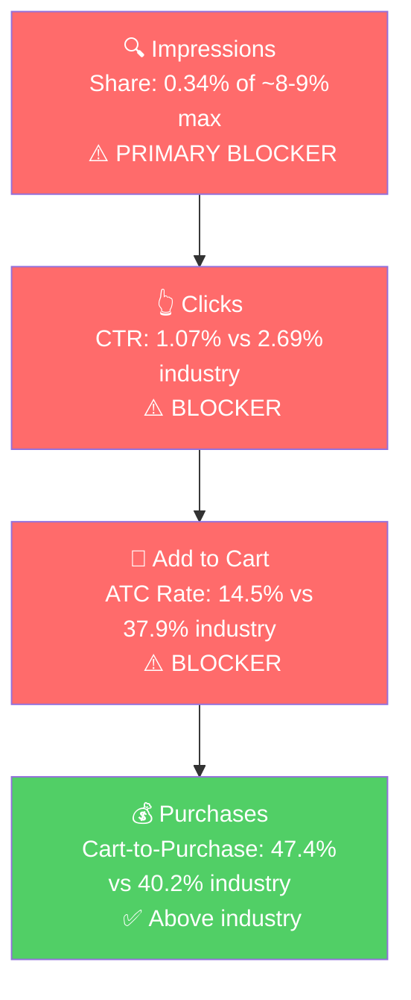

# Seller Central Audit - Z Blok Sunscreen

## Section 1: Catalog Assessment

| Priority | Product | 3-Mo Sales | 3-Mo Ad Spend | ROAS | TACoS | Organic Sales | Ad Sales % | Buy Box % | CVR | Trend |
|----------|---------|-----------|--------------|------|-------|---------------|-----------|-----------|-----|-------|
| P0 | Lip Balm & SPF 30 (B01D4ZIOAA) | $25,718.70 | $725.52 | 2.59 | 2.82% | $23,839.95 | 7.3% | 99.8% | 60.6% | Growing |
| P1 | 4 oz. SPF 45 (B07K3WTH3C) | $2,134.65 | $0 | n/a | 0% | $2,134.65 | 0% | 89.5% | 53.9% | Volatile |
| P2 | Stick SPF 45 Mineral (B01C6HBFBC) | $1,359.75 | $0 | n/a | 0% | $1,359.75 | 0% | 98.5% | 57.4% | Growing |
| P3 | SPF 45 2 Oz. (B06XZ6DRSF) | $809.10 | $0 | n/a | 0% | $809.10 | 0% | 99.4% | 32.2% | Growing, low CVR |

P0 is 86% of revenue and receives 100% of ad spend. P1/P2/P3 are small, organic-only, and the leverage lives on P0.

## Section 2: P0 Product Overview

**Product:** SPF 30 mineral lip balm in stick form, sold as a 3-pack at ~$12.80 ($4.27/stick). Zinc oxide is the only active ingredient, marketed as "Clear Zinc" — rubs in without the white cast typical of mineral sunscreens. Broad-spectrum, waterproof, made in the USA.

**Customer:** Outdoor users (sailing, surfing, beach, hiking, ski) and clean-beauty / mineral-preference buyers who avoid chemical UV filters.

### Competitive Landscape

Market range is $1.50-$16/stick. Z Blok sits mid-range at $4.32/stick, comparable to Sun Bum and Burt's Bees.

| Competitor | Key Product | Price/Stick | SPF | Formula | Notes |
|---|---|---|---|---|---|
| Sun Bum | Original SPF 30 Lip Balm | ~$3.50 | 30 | Chemical | Category leader, multiple flavors |
| Burt's Bees | SPF 30 Lip Balm | ~$3.50-4.00 | 30 | Mineral (zinc) | Household name, natural positioning |
| Banana Boat | Sport Ultra SPF 50 Lip | ~$2.20 | 50 | Chemical | Budget leader, highest SPF |
| Jack Black | Intense Therapy SPF 25 | ~$9.50 | 25 | Chemical | Premium grooming, Sephora/Nordstrom |
| Supergoop | Play Lipscreen / Lip Oil | ~$14 | varies | Mineral | Premium clean-beauty |

Z Blok's differentiator is **100% mineral (zinc oxide only) that goes on clear.** Most bestsellers use chemical UV filters. Among the mineral options, only Burt's Bees and Sun Bum's mineral variant compete on the zinc angle, and neither emphasises "no white cast" the way Z Blok can.

### Listing Quality

**Strengths:**
- **Rating:** 4.6 from 535 reviews. 82% five-star, 1% one-star. Rating has been stable at 4.6-4.7 since 2020 (up from 4.0-4.1 in 2017-2019). The product is well-loved; the listing is what's holding it back.
- **Subscribe & Save enabled:** supports repeat-purchase behaviour on a consumable sun-protection product.

**Opportunities:**

- **Title (34 characters):** "Z Blok Lip Balm & SPF 30 Sunscreen." Uses ~17% of the 200-character allowance. Missing every key selling point: mineral, zinc oxide, clear, waterproof, reef safe, 3-pack, made in USA. Competitors use 150+ character titles packed with search terms.
  - Suggested: *"Z Blok SPF 30 Lip Balm Sunscreen, Mineral Zinc Oxide, Clear Formula, Waterproof, Reef Safe, All Natural Lip Sun Protection, Made in USA, 3-Pack"*

- **Bullets (zero):** The listing has no feature bullets. This is the single biggest gap. On Amazon, bullets are the primary conversion driver, and the product's strong selling points are completely invisible.
  - Suggested bullets:
    - **MINERAL SUN PROTECTION:** Made with zinc oxide as the only active ingredient. Broad-spectrum SPF 30 shields lips from UVA and UVB rays without chemical sunscreen filters.
    - **GOES ON CLEAR:** Unlike traditional zinc sunscreens, Z Blok's Clear Zinc formula applies without a white cast. Invisible protection that looks natural on your lips.
    - **WATERPROOF AND LONG-LASTING:** Stays on through swimming, sailing, surfing, and sweating. Built for outdoor athletes and anyone who needs protection that lasts.
    - **ALL NATURAL AND REEF SAFE:** No fragrances, no chemical UV filters, no parabens. Safe for sensitive skin and safe for ocean environments.
    - **3-PACK VALUE:** Three 0.15 oz lip balm tubes. Keep one in your beach bag, one in your car, and one at home. Made in the USA.

- **Images (3 total):** One 3-pack packaging shot, one single-tube close-up, and one generic stock "UV Protection" shield graphic that adds nothing and should be removed. A category this visual needs at minimum:
  - Lifestyle: someone applying the balm outdoors (sailing, beach, hiking)
  - Before/after or application shot showing the clear zinc in action
  - Benefit infographic (mineral, waterproof, reef safe, made in USA)
  - Comparison visual: Z Blok clear application vs. white-cast zinc competitors
  - Ingredient callout emphasising zinc oxide as the only active

- **A+ Content (absent):** Z Blok has a genuine story to tell (founder developed the product after personal skin-cancer experience; Puma Ocean Racing Team used it as official sunscreen for the 2011/12 Volvo Ocean Race). A+ with lifestyle imagery on the water, the founder narrative, and a mineral-vs-chemical comparison module would strengthen both conversion and brand trust.

- **Video (absent):** The "goes on clear" claim is the strongest differentiator, but a shopper has no way to verify it without video. A 30-second demonstration showing application, the clear finish, and water-resistance would directly address purchase hesitation.

- **Brand Store (absent):** Z Blok has a full product line (body sunscreen, kids formula, lip balm). A brand store enables cross-selling and gives the brand more control over its Amazon presence.

## Section 3: Quantitative Product Understanding (P0)

**Annual Trend (B01D4ZIOAA):**

| Metric | Jun 2025 (peak) | Nov 2025 (trough) | Feb 2026 (ads launch) | Mar 2026 (latest) |
|--------|-----------------|--------------------|------------------------|--------------------|
| Total Sales | $13,857 | $4,196 | $7,576 | $12,691 |
| Sessions | 1,895 | 464 | 1,028 | 1,552 |
| CVR | 56.9% | 70.5% | 57.4% | 63.8% |
| Buy Box % | 99.9% | 99.3% | 99.9% | 99.9% |

- Revenue cycles ~3x between summer peak and late-fall trough, matching the SPF-lip-balm search volume cycle in SQP. Market-seasonal, not brand-specific.
- Mar 2026 ($12.7K) is already at last summer's peak range, with 2-3 months to peak demand still ahead. Best possible timing window for listing and ad fixes to land before demand rises.
- Off-season CVR climbs to 70%+ (branded/repeat-heavy) and settles at 55-60% in peak (discovery traffic arriving). CVR ceiling is extraordinarily high either way.

**Rating Trajectory:** Stable. 4.6-4.7 for 5+ years. Durable asset.

**Sales Rank Trajectory:** Seasonal. Summer peak rank ~305-315 in Lip Balms & Moisturizers, winter trough ~880-1,034. Roughly 3x sales velocity swing between peak and trough.

## Section 4: Market Opportunity (SQP)

**Tier Breakdown:**

- **Tier 1 (Hero - SPF lip balm direct intent):**
  - **Keywords:** `spf lip balm`, `lip balm spf`, `lip sunscreen`, `sunscreen lip balm`, `sunscreen lip balm spf 50`, `zinc lip sunscreen`, `zinc lip balm`, `mineral lip sunscreen`, `mineral sunscreen lip balm`, `lip sunscreen spf 50`, `lip sunscreen spf 70 waterproof`, `spf lip balm 50`, `spf lip`
  - **Rationale:** Direct intent. The customer explicitly wants SPF lip balm (often specifying zinc/mineral formulation or SPF level) and the product is the literal answer.

- **Tier 2 (Competitor conquest):**
  - **Keywords:** `sun bum lip balm`, `jack black lip balm`, `coola lip balm spf 30`, `blistex medicated spf lip balm`, `chapstick active 2-in-1 sunscreen lip balm`
  - **Rationale:** Customers searching mainstream SPF-lip-balm competitors who would buy Z Blok if surfaced in front of them.

- **Tier 3 (Broad/adjacent):**
  - **Keywords:** `lip balm`
  - **Rationale:** Mass-market lip balm intent. Z Blok can show but most searchers do not want SPF specifically. Sized for context, not pursued.

**Market Sizing (12-month avg):**

| Tier | Monthly Search Volume | Monthly Add to Carts (Market) | Monthly Purchases (Market) | Est. Market Size ($/mo) |
|------|----------------------|-------------------------------|---------------------------|------------------------|
| Tier 1 | 249,868 | 49,877 | 11,365 | ~$399,000 |
| Tier 2 | 17,783 | 5,241 | 2,292 | ~$26,200 |
| Tier 3 | 581,778 | 96,142 | 34,459 | ~$480,700 |
| **Total P0-relevant** | **712,495** | **129,849** | **48,116** | **~$734,600** |

*Estimated using $8 Tier 1 (SPF lip balm avg), $5 Tier 2 and Tier 3 (mainstream lip balm mix). Z Blok's own 3-pack is $12.80 at $4.27/stick.*

**Blockers & Growth Path:**

| Tier | Impression Share | CTR (Brand vs Industry) | CVR (Brand vs Industry) | Primary Blocker | Growth Path |
|------|-----------------|------------------------|------------------------|-----------------|-------------|
| Tier 1 | 0.34% of ~8-9% max (Blocker) | 1.07% vs 2.69% (Blocker) | 6.87% vs 15.22% (Blocker) | Impression Share + CTR + ATC | Fix listing first, then scale PPC for impression share |
| Tier 2 | Low | n/a | n/a | Impression Share | Small competitor-conquest after Tier 1 unlocks |
| Tier 3 | 0.003% | n/a (intent mismatch) | n/a | Intent mismatch | Skip |

**ICAP Funnel Visual (Tier 1):**

- Tier 1 impression share declined Jan (0.43%) > Feb (0.35%) > Mar (0.29%) as the market grew seasonally. Competitors absorbed the seasonal demand lift; Z Blok did not.
- The one funnel stage Z Blok beats industry on is cart-to-purchase (47.4% vs 40.2%). Once a shopper commits to cart, brand/price/rating close the sale. The failures are visibility and listing presentation, not the product.

## Section 5: Ad Analysis

The ad account is 10 weeks old, one campaign, 2.59 ROAS, 2.82% TACoS, 100% on P0. Fundamentals work. Structure does not.

### Account Level

**Campaign Structure**

One campaign ("Februarylipbalm") with a single BROAD target on `lip balm` plus Amazon's "Keywords related to your product category" group.

| Target | Match | Clicks | Spend | Sales | ROAS | Orders |
|--------|-------|--------|-------|-------|------|--------|
| `lip balm` | BROAD | 317 | $647.33 | $1,645.65 | 2.54 | 122 |
| Keywords related to your product category | - | 43 | $78.19 | $233.10 | 2.98 | 16 |

> **Finding: The entire ad strategy is one broad match on "lip balm."**
>
> **Problem:**
> - A single BROAD target on the most generic lip-balm keyword means Amazon decides the search terms. The search-term report shows 90+ distinct terms have spent money, with ROAS ranging from 0 to 8.75. Winners and losers sit at the same blended bid.
> - Proven-winner search terms have no dedicated Exact-match campaign: `zinc oxide lip balm` (3.87 ROAS), `spf 30 lip balm` (4.36 ROAS), `lip balm with spf 30` (7.36 ROAS), `zinc lip balm` (2.43 ROAS).
> - Tier 1 SQP queries have no dedicated campaign either, despite 0.34% impression share on an 8-9% cap.
>
> **Solution:**
> - Two new Exact-match campaigns: (1) winner harvest — `zinc oxide lip balm`, `spf 30 lip balm`, `lip balm with spf 30`, `zinc lip balm`, `zinc spf lip balm`, `zinc for lips`. (2) Tier 1 impression-share push — `spf lip balm`, `lip sunscreen`, `sunscreen lip balm`, `lip balm spf` and the rest of the Tier 1 list above.
> - Negate those terms from the broad campaign so spend is not duplicated.

**Auto vs Manual Split**

| Targeting Type | Clicks | Spend | Sales | ROAS | AOV | CPC | CVR |
|----------------|--------|-------|-------|------|-----|-----|-----|
| Automatic | 0 | $0 | $0 | - | - | - | - |
| Manual | 360 | $725.52 | $1,878.75 | 2.59 | $13.61 | $2.02 | 38.3% |

No auto campaign. Without one, Amazon's algorithm is not discovering new search terms to harvest. A small auto campaign ($5-10/day, capped bids) mined every 2 weeks would keep the harvest loop full.

**Campaign Profitability**

One campaign, profitable at 2.59 ROAS. No campaigns to pause. Placement-level unprofitability covered below.

**Targeting Strategy**

**Keyword vs Product Targeting:**

| Targeting Strategy | Clicks | Spend | Sales | ROAS | AOV | CPC | CVR |
|--------------------|--------|-------|-------|------|-----|-----|-----|
| Keyword Targeting | 360 | $725.52 | $1,878.75 | 2.59 | $13.61 | $2.02 | 38.3% |
| Product Targeting | 0 | $0 | $0 | - | - | - | - |

No product targeting. Unused defensive lever (own-ASIN, prevent poaching) and offensive lever (competitor ASIN conquest on Sun Bum, Jack Black, Supergoop).

**Match Type Breakdown:**

| Match Type | Clicks | Spend | Sales | ROAS | AOV | CPC | CVR |
|------------|--------|-------|-------|------|-----|-----|-----|
| EXACT | 0 | $0 | $0 | - | - | - | - |
| PHRASE | 0 | $0 | $0 | - | - | - | - |
| BROAD | 317 | $647.33 | $1,645.65 | 2.54 | $13.49 | $2.04 | 38.5% |

100% broad. No harvest-and-scale loop in place.

### Product Level (P0)

**P0 Campaign Map**

| Campaign | Spend | Sales | ROAS | Clicks | Orders |
|----------|-------|-------|------|--------|--------|
| Februarylipbalm | $725.52 | $1,878.75 | 2.59 | 360 | 138 |

100% of ad spend on P0. Right product being advertised.

#### Impression Share Blocker: Tier 1 Keyword Spend

> **SQP identified Tier 1 impression share (0.34% vs 8-9% cap) as the primary blocker. The PPC lever is to bid on these queries specifically.**

| Tier 1 Search Term | Spend | Sales | ROAS | Clicks | Orders |
|--------------------|-------|-------|------|--------|--------|
| spf lip balm | $6.60 | $12.95 | 1.96 | 3 | 1 |
| lip balm spf | $8.12 | $25.90 | 3.19 | 4 | 2 |
| lip sunscreen | $17.17 | $51.80 | 3.02 | 9 | 2 |
| sunscreen lip balm | $6.47 | $0 | 0 | 3 | 0 |
| **Tier 1 total** | **$38.36** | **$90.65** | **2.36** | **19** | **5** |

Tier 1 queries get $38 (~5% of budget) over 10 weeks for a market of ~112K searches/mo. Where they convert (`lip balm spf` 3.19 ROAS, `lip sunscreen` 3.02 ROAS), they convert profitably. Click volume is simply too low to move impression share. Dedicated Exact campaign at $15-20/day budget with $2.50-$3.00 target CPC is the lever.

#### CTR Blocker: Placement Distribution

| Placement | Spend | Sales | ROAS | CTR | CVR | Orders |
|-----------|-------|-------|------|-----|-----|--------|
| Top of Search | $505.55 | $1,386.65 | 2.74 | 3.30% | 42.9% | 103 |
| Rest of Search | $167.86 | $427.35 | 2.55 | 0.18% | 33.0% | 30 |
| Product Pages | $52.11 | $64.75 | 1.24 | 0.10% | 17.2% | 5 |

Top of Search is doing the work (3.30% CTR vs 2.69% industry, 42.9% CVR). Product Pages runs at 1.24 ROAS and 17.2% CVR — the listing does not hold up against competitor PDPs. Apply -70% on Product Pages and +50% on Top of Search. The real CTR/ATC lever is the listing overhaul.

#### Wasted Search Terms

| Search Term | Spend | Orders | Reason |
|-------------|-------|--------|--------|
| carmex classic medicated lip balm sticks | $3.30 | 0 | Medicated lip balm, not SPF |
| cortizone 10 lip balm | $2.99 | 2 | Hydrocortisone, not SPF |
| zumbo kiss lip balm | $2.64 | 0 | Unrelated |
| vitamin e lip balm stick | $2.64 | 0 | Not SPF |
| tinted lip balm with spf | $3.96 | 0 | Tinted is a different category |
| all good lip balm | $2.64 | 0 | Competitor brand, not SPF |
| extreme weather lip balm | $2.64 | 0 | Not SPF-specific |

~$20-25 wasted over 10 weeks. Small but a clean-up.

#### Branded Defense

Brand typos (`zblock`, `z block`) already convert at 7-8 ROAS inside the broad campaign. No dedicated branded-defense campaign exists. A protective $2-5/day campaign on `z blok`, `z blok lip balm`, `z blok sunscreen`, and typos will prevent competitor poaching. Keep under 3-5% of budget per standard branded guidance.

## Section 6: Action Plan

Listing is the blocker. Scaling PPC onto a leaky funnel burns budget. Sequence is listing first, ads second, then re-measure and iterate.

### Weeks 1-3: Listing Overhaul

- Rewrite title to the 150+ character spec (mineral, zinc oxide, clear, waterproof, reef safe, 3-pack, made in USA).
- Publish 5 bullets leading with Clear Zinc > Waterproof SPF 30 > Mineral/Reef-Safe > 3-Pack > Made in USA.
- Produce new images: lifestyle (sailing/beach/hiking application), clear-zinc-vs-white-cast comparison, benefits infographic, ingredients callout. Remove the stock UV shield graphic.
- Build A+ content modules: founder / Volvo Ocean Race credibility block, mineral vs chemical comparison, lifestyle, ingredients transparency.
- Film a 30-second application video demonstrating "goes on clear" and water resistance.
- Launch Brand Store with Lip Balm (P0), 4oz, 2oz, Stick arranged under a "Clear Zinc Technology" narrative.
- Investigate and fix the zero-bullet anomaly (possibly a Seller Central config / category restriction on an older listing).

### Weeks 3-6: PPC Launch

- Launch Tier 1 Exact-match campaign on the 13 Tier 1 keywords above. $15-20/day, $2.50-$3.00 target CPC.
- Launch Tier 2 Exact-match competitor-conquest campaign on the 5 Tier 2 competitor terms. Smaller budget ($5-10/day) to start.
- Launch 1-2 new Broad discovery campaigns on fresh themes (mineral/zinc angle, outdoor/sport angle) to keep discovering new converters.
- Apply Top-of-Search +50% and Product Pages -70% on the main campaign. Negate confirmed winners from the broad campaign.
- Launch branded defense campaign ($2-5/day) on `z blok`, `z blok lip balm`, `z blok sunscreen`, typos.

### Week 6: Re-audit

- Re-run the full audit (Step 1 catalog refresh, Step 3 SQP re-pull, Step 4 ad analysis) to measure what moved.
- Baseline vs Week 6: Tier 1 impression share (from 0.34%), CTR (from 1.07%), ATC rate (from 14.5%), overall revenue trajectory.

### Weeks 6-8: Scale and Iterate

- Scale Tier 1 / Tier 2 Exact budgets proportionally to ROAS improvement. If listing fixes lift ATC toward industry (37.9%), effective ROAS on Tier 1 Exact doubles or triples, which justifies further budget increases.
- Mine search-term reports from broad and auto campaigns every two weeks, promote new winners into Exact.
- Evaluate P1 (4 oz.) readiness for its own audit + PPC treatment.
- Pre-stage bid/budget calendar for the Jun-Jul summer peak.
- Continue iterating on listing and ad levers based on Week 6 re-audit findings.

## Section 7: Insights & Questions for the Seller

### Insights

- **P0 is the entire business and the entire opportunity.** 86% of revenue, 100% of ad spend, and the only ASIN with a clear product wedge ("Clear Zinc"). Every lever in this audit is a P0 lever.
- **The ceiling is almost entirely untouched.** Tier 1 impression share is 0.34% against an 8-9% cap. The one funnel stage Z Blok beats industry on is cart-to-purchase (47% vs 40%). The product converts when surfaced. The problem is visibility plus a listing that leaks traffic when it is surfaced.
- **Listing fixes have a 6-7x ad-spend multiplier.** Bringing CTR from 1.07% to industry 2.69% is 2.5x clicks on the same impressions. Bringing ATC from 14.5% to industry 37.9% is 2.6x orders on the same clicks. Compounded, 6-7x orders on the same ad spend before any impression-share move.
- **Seasonality is market-driven and we are 2-3 months from peak.** SQP Tier 1 search volume cycles 3.5x from December trough to June peak. March 2026 revenue ($12.7K) is already back to last summer's peak range. Every week of execution saved upfront compounds through the seasonal ramp.
- **Ads already work. Structure does not.** One broad campaign at 2.59 ROAS and 2.82% TACoS, ten weeks old, is evidence the product converts on paid traffic. The account has zero exact-match campaigns, zero auto discovery, zero product targeting, and zero branded defense. Every one of those is an unused lever.

### Questions for the Seller

- Is there a reason the listing has no bullet points or A+ content? Hypothesis: a "set it and forget it" listing from years ago, with content optimisation never prioritised.
- What percentage of Amazon sales come from Subscribe & Save vs one-time purchases? Hypothesis: on a consumable product, S&S could be a meaningful revenue stream worth optimising around.
- Do you see peak season as purely summer, or do you get meaningful volume from winter sports (skiing, snowboarding) and travel? Hypothesis: there may be an opportunity to extend the selling season with winter-outdoor and travel-related keywords.
- Ads launched in Feb 2026. Was there prior ad history on any Z Blok product that predates that, and if so, why paused/restarted?
- P1 (4 oz. SPF 45) had a buy box dip to ~81% in Feb 2026. Any price changes, promotions, or MAP-related events around that time?
- Who built the "Februarylipbalm" campaign — seller, agency, or in-house? Informs whether we implement directly or hand off the plan.
- Is there existing photography/video content for the Lip Balm, or is content production greenfield? Drives the Weeks 1-3 timeline.
