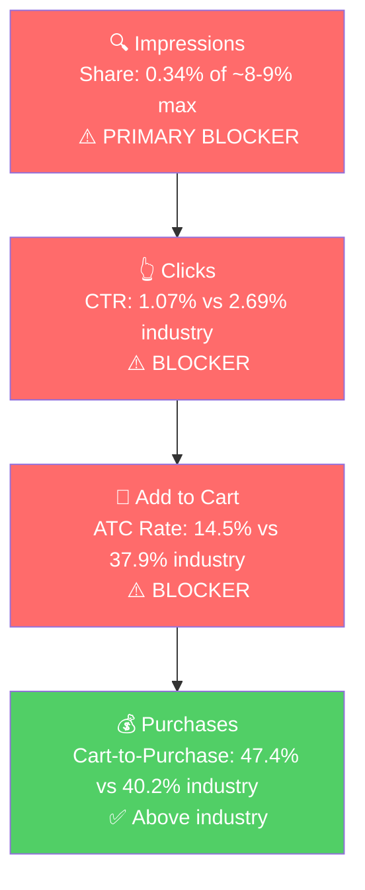

# Seller Central Audit - Z Blok Sunscreen

## Section 1: Catalog Assessment

| Priority | Product | 3-Mo Sales | 3-Mo Ad Spend | ROAS | TACoS | Organic Sales | Ad Sales % | Buy Box % | CVR | Trend |
|----------|---------|-----------|--------------|------|-------|---------------|-----------|-----------|-----|-------|
| P0 | Lip Balm & SPF 30 (B01D4ZIOAA) | $25,718.70 | $725.52 | 2.59 | 2.82% | $23,839.95 | 7.3% | 99.8% | 60.6% | Growing |
| P1 | 4 oz. SPF 45 (B07K3WTH3C) | $2,134.65 | $0 | n/a | 0% | $2,134.65 | 0% | 89.5% | 53.9% | Volatile |
| P2 | Stick SPF 45 Mineral (B01C6HBFBC) | $1,359.75 | $0 | n/a | 0% | $1,359.75 | 0% | 98.5% | 57.4% | Growing |
| P3 | SPF 45 2 Oz. (B06XZ6DRSF) | $809.10 | $0 | n/a | 0% | $809.10 | 0% | 99.4% | 32.2% | Growing, low CVR |

P0 is 86% of revenue and receives 100% of ad spend. P1/P2/P3 are small, organic-only, and advertising them is not where the leverage is.

## Section 2: Qualitative Product Understanding (P0)

**Product:**
- SPF 30 mineral lip balm in stick form, sold as a 3-pack (0.45 oz total, $4.27/stick).
- Zinc oxide is the only active ingredient, marketed as "Clear Zinc" that rubs in without the white cast of typical zinc sunscreens. Waterproof, broad-spectrum SPF 30, made in the USA.
- **Value prop:** Lip sun protection without the white cast of mineral sunscreens, and without the chemical actives (oxybenzone, octinoxate, avobenzone) that sensitive-skin and reef-safe buyers avoid.
- **Purchase motivation:** Daily lip sun protection for outdoor users (beach, hiking, ski, watersports) who prefer mineral over chemical formulations.

**Customer:**
- Adults buying sun protection for everyday or outdoor use, skewing toward "clean beauty / mineral sunscreen" preference.
- Purchase driver: mineral-only formulation + waterproof + no visible zinc residue.

**Brand:**
- Registered brand ("Z Blok"), established, 7+ years of Amazon selling history (rating stable at 4.6+ since 2020).
- Functional, early-2010s outdoor/sport aesthetic. Packaging is text-dense and retail-shelf oriented, not the minimalist clean-beauty look.
- Full catalog of 4 SPF SKUs with consistent "Clear Zinc" trade dress across the line.

**Competitive Landscape:**

Avg standalone SPF lip balm price: ~$7-8/stick. P0: $4.27/stick (as part of $12.80 3-pack). **~40% below per-stick market average, and the 3-pack format is a pack-size advantage.**

| Brand | Product | Positioning |
|-------|---------|-------------|
| Sun Bum | SPF 30 Lip Balm | Mainstream, strong brand equity, ~$4/stick |
| Jack Black | Intense Therapy Lip Balm SPF 25 | Premium men's grooming, ~$8.50/stick |
| Supergoop | Play Lipscreen / Every Day Lip Oil | Premium clean-beauty, ~$14/stick |
| Blistex | Five Star Lip Protection SPF 30 | Mass-market value, ~$3/stick |

Z Blok owns a real product wedge (mineral-only + clear zinc + waterproof) but is not communicating it on the listing.

**Listing Quality:**

**Strengths:**
- **Rating:** 4.6 stars on 535 reviews, stable for 4+ years. 82% 5-star. Social proof is a durable asset, not a blocker.
- **Main image:** Reads clearly as a 3-pack SPF lip balm at a glance, Clear Zinc callout is visible.

**Opportunities:**
- **Title:** 34 characters ("Z Blok Lip Balm & SPF 30 Sunscreen"). Uses ~17% of the 200-character allowance. Missing `mineral`, `zinc oxide`, `reef safe`, `waterproof`, `clear zinc`, `3-pack`, `all natural`, `made in USA`.
- **Bullets:** Zero bullets. Every selling point that justifies the "Clear Zinc" wedge is absent from the five highest-attention slots on the page. Single biggest conversion fix in the account.
- **Images:** 3 total (main + 2 variants). Variant 2 is a generic stock-art UV shield unrelated to the product, actively hurting CVR. Amazon allows 7+ images; Z Blok uses 3 and wastes 1.
- **A+ Content:** Absent. For a mineral sunscreen brand competing against Sun Bum, Supergoop, and Jack Black A+ pages, this is a visible gap.
- **Video:** Absent. "Clear zinc, rubs in clear" is a claim that must be seen to be believed.
- **Brand Store:** Absent. Cross-sell to the 4 SPF SKUs across the catalog is unsupported.

## Section 3: Quantitative Product Understanding (P0)

**Annual Trend (B01D4ZIOAA):**

| Metric | Jun 2025 (peak) | Nov 2025 (trough) | Feb 2026 (ads launch) | Mar 2026 (latest) |
|--------|-----------------|--------------------|------------------------|--------------------|
| Total Sales | $13,857 | $4,196 | $7,576 | $12,691 |
| Sessions | 1,895 | 464 | 1,028 | 1,552 |
| CVR | 56.9% | 70.5% | 57.4% | 63.8% |
| Buy Box % | 99.9% | 99.3% | 99.9% | 99.9% |

- Revenue cycles 3x between summer peak and late-fall trough, matching the SPF-lip-balm search volume cycle in SQP almost exactly. This is market seasonality, not a brand-specific issue.
- Mar 2026 ($12.7K) is already at the range of last summer's peak, with 2-3 months to peak demand still ahead. This is the single best timing window for fixing the listing and scaling ads.
- Off-season CVR climbs to 70%+ (almost entirely branded/repeat traffic in low-volume months) and settles at 55-60% in peak (discovery traffic arriving). Either way the CVR ceiling is extraordinarily high.

**Rating Trajectory:** Stable. 4.6-4.7 for 4+ years. Durable asset.

**Sales Rank Trajectory:** ~375-446 in Lip Balms & Moisturizers sub-category over the last 2 weeks. Solid top-500 position.

## Section 4: Market Opportunity (SQP)

**Tier Breakdown:**

- **Tier 1 (Hero - SPF lip balm direct intent):**
  - **Keywords:** `spf lip balm`, `lip balm spf`, `lip sunscreen`, `sunscreen lip balm`
  - **Rationale:** Direct intent. The customer explicitly wants SPF lip balm, and the product is the literal answer.

- **Tier 2 (Competitor conquest):**
  - **Keywords:** `sun bum lip balm`
  - **Rationale:** Customers searching the mainstream SPF-lip-balm leader who would buy Z Blok if surfaced. Only one high-volume competitor query in the data.

- **Tier 3 (Broad/adjacent):**
  - **Keywords:** `lip balm`
  - **Rationale:** Mass-market lip balm intent. Z Blok can show up but most searchers do not want SPF specifically. Sized, not pursued.

**Market Sizing (12-month avg, Apr 2025 - Mar 2026):**

| Tier | Monthly Search Volume | Monthly Add to Carts (Market) | Monthly Purchases (Market) | Est. Market Size ($/mo) |
|------|----------------------|-------------------------------|---------------------------|------------------------|
| Tier 1 | 112,934 | 28,466 | 11,365 | ~$227,700 |
| Tier 2 | 17,783 | 5,241 | 2,292 | ~$26,200 |
| Tier 3 | 581,778 | 96,142 | 34,459 | ~$480,700 |
| **Total P0-relevant** | **712,495** | **129,849** | **48,116** | **~$734,600** |

*Estimated using $8 Tier 1 (SPF lip balm avg), $5 Tier 2 (Sun Bum is ~$4-5), $5 Tier 3 (broad lip balm mix).*

**Blockers & Growth Path:**

| Tier | Impression Share | CTR (Brand vs Industry) | CVR (Brand vs Industry) | Primary Blocker | Growth Path |
|------|-----------------|------------------------|------------------------|-----------------|-------------|
| Tier 1 | 0.34% of ~8-9% max (Blocker) | 1.07% vs 2.69% (Blocker) | 6.87% vs 15.22% (Blocker) | Impression Share + CTR + ATC | Fix listing first, then scale PPC for impression share |
| Tier 2 | 0.06% (data thin) | n/a | n/a | Impression Share | Small competitor-conquest after Tier 1 unlocks |
| Tier 3 | 0.003% | n/a (intent mismatch) | n/a | Intent mismatch | Skip |

**ICAP Funnel Visual (Tier 1):**

- Tier 1 impression share declined Jan (0.43%) > Feb (0.35%) > Mar (0.29%) as the market grew seasonally. Competitors absorbed the extra demand; Z Blok did not.
- The one funnel stage Z Blok beats industry is cart-to-purchase (47.4% vs 40.2%). Once a shopper commits to the cart, brand/price/rating close the sale. The failures are visibility and listing presentation, not the product or the brand.

## Section 5: Ad Analysis

The ad account is 10 weeks old, one campaign, 2.59 ROAS, 2.82% TACoS, 100% on P0. Fundamentals work. Structure does not.

### Account Level

**Campaign Structure**

One campaign ("Februarylipbalm") containing a single BROAD target on `lip balm` plus Amazon's "Keywords related to your product category" group.

| Target | Match | Clicks | Spend | Sales | ROAS | Orders |
|--------|-------|--------|-------|-------|------|--------|
| `lip balm` | BROAD | 317 | $647.33 | $1,645.65 | 2.54 | 122 |
| Keywords related to your product category | - | 43 | $78.19 | $233.10 | 2.98 | 16 |

> **Finding: The entire ad strategy is one broad match on "lip balm."**
>
> **Problem:**
> - A single BROAD target on the most generic lip-balm keyword means Amazon decides the search terms. The search-term report shows 90+ distinct terms have spent money, with ROAS 0 to 8.75. Winners and losers sit at the same blended bid.
> - Proven-winner search terms have no dedicated Exact-match campaign: `zinc oxide lip balm` (3.87 ROAS), `spf 30 lip balm` (4.36 ROAS), `lip balm with spf 30` (7.36 ROAS), `zinc lip balm` (2.43 ROAS).
> - Tier 1 SQP queries have no dedicated campaign either, despite SQP showing 0.34% impression share on an 8-9% cap.
>
> **Solution:**
> - Two new Exact-match campaigns: (1) winner harvest - `zinc oxide lip balm`, `spf 30 lip balm`, `lip balm with spf 30`, `zinc lip balm`, `zinc spf lip balm`, `zinc for lips`. (2) Tier 1 impression-share push - `spf lip balm`, `lip sunscreen`, `sunscreen lip balm`, `lip balm spf`.
> - Negate those terms from the broad campaign so spend is not duplicated.
>
> **Impact:**
> - Tier 1 market = 11,365 purchases/mo. Z Blok is at ~7 purchases/mo (0.06% share). Moving to 0.5% purchase share = ~57 purchases/mo, +$740/mo, ~$9K/yr at off-peak volume. Peak summer volume is 3.5x this, so the same share % produces proportionally more.

**Auto vs Manual Split**

| Targeting Type | Clicks | Spend | Sales | ROAS | AOV | CPC | CVR |
|----------------|--------|-------|-------|------|-----|-----|-----|
| Automatic | 0 | $0 | $0 | - | - | - | - |
| Manual | 360 | $725.52 | $1,878.75 | 2.59 | $13.61 | $2.02 | 38.3% |

> **Finding: No auto campaign.**
>
> **Problem:** Without auto, Amazon's algorithm is not running in the background to find new search terms to harvest.
>
> **Solution:** Small auto campaign ($5-10/day, capped bids) dedicated to discovery. Mine search terms every 2 weeks, move winners to Exact.
>
> **Impact:** Keeps the harvest loop full. Without it, term discovery plateaus.

**Campaign Profitability**

Only one campaign, profitable at 2.59 ROAS. No campaigns to pause. Placement-level unprofitability covered below.

**Targeting Strategy**

**Keyword vs Product Targeting:**

| Targeting Strategy | Clicks | Spend | Sales | ROAS | AOV | CPC | CVR |
|--------------------|--------|-------|-------|------|-----|-----|-----|
| Keyword Targeting | 360 | $725.52 | $1,878.75 | 2.59 | $13.61 | $2.02 | 38.3% |
| Product Targeting | 0 | $0 | $0 | - | - | - | - |

No product targeting. An unused lever for defensive (own-ASIN, prevent poaching) and offensive (competitor conquest on Sun Bum, Jack Black, Supergoop ASINs) use.

**Match Type Breakdown:**

| Match Type | Clicks | Spend | Sales | ROAS | AOV | CPC | CVR |
|------------|--------|-------|-------|------|-----|-----|-----|
| EXACT | 0 | $0 | $0 | - | - | - | - |
| PHRASE | 0 | $0 | $0 | - | - | - | - |
| BROAD | 317 | $647.33 | $1,645.65 | 2.54 | $13.49 | $2.04 | 38.5% |

100% broad. No harvest-and-scale loop in place. Specific recommendations above.

### Product Level (P0)

**P0 Campaign Map**

| Campaign | Spend | Sales | ROAS | Clicks | Orders |
|----------|-------|-------|------|--------|--------|
| Februarylipbalm | $725.52 | $1,878.75 | 2.59 | 360 | 138 |

P0 ad spend share of total account ad spend: **100%**. Right product being advertised.

#### Impression Share Blocker: Keyword Spend vs. Tier 1 Queries

> **SQP identified Tier 1 impression share (0.34% vs 8-9% cap) as the primary blocker. The PPC lever is to bid on these queries specifically.**

| Tier 1 Search Term | Spend | Sales | ROAS | Clicks | Orders |
|--------------------|-------|-------|------|--------|--------|
| spf lip balm | $6.60 | $12.95 | 1.96 | 3 | 1 |
| lip balm spf | $8.12 | $25.90 | 3.19 | 4 | 2 |
| lip sunscreen | $17.17 | $51.80 | 3.02 | 9 | 2 |
| sunscreen lip balm | $6.47 | $0 | 0 | 3 | 0 |
| **Tier 1 total** | **$38.36** | **$90.65** | **2.36** | **19** | **5** |

> **Problem:** Tier 1 is getting $38 (~5% of budget) over 10 weeks for queries covering ~112K searches/mo. Where they convert (`lip balm spf`, `lip sunscreen`), they convert profitably. Click volume is too low to move impression share.
>
> **Solution:** Dedicated Exact campaign on Tier 1 terms with $15-20/day budget and $2.50-$3.00 target CPC. Negate from the broad campaign.
>
> **Impact:** See "Campaign Structure" above. ~$9K/yr at 0.5% purchase share, scaling with peak-season volume.

#### CTR Blocker: Placement Distribution

| Placement | Spend | Sales | ROAS | CTR | CVR | Orders |
|-----------|-------|-------|------|-----|-----|--------|
| Top of Search | $505.55 | $1,386.65 | 2.74 | 3.30% | 42.9% | 103 |
| Rest of Search | $167.86 | $427.35 | 2.55 | 0.18% | 33.0% | 30 |
| Product Pages | $52.11 | $64.75 | 1.24 | 0.10% | 17.2% | 5 |

> **Problem:**
> - Top of Search runs 3.30% CTR (above 2.69% industry) and 42.9% CVR at 2.74 ROAS. It is working.
> - Product Pages runs at 1.24 ROAS (below 1.5x profitability threshold) and 17.2% CVR. The listing does not hold up against natively-shown products on competitor PDPs. $52 of weak spend.
>
> **Solution:**
> - Apply -50% to -80% Product Pages bid modifier until the listing is fixed. Shift budget to Top of Search (+25-50% modifier).
> - Listing fix (Weeks 4-6) is the real CTR+ATC lever and is where the multiplier is.
>
> **Impact:**
> - Bid-modifier shift alone: small, +$75 over 10 weeks.
> - Listing CTR 1.07% > 2.69% = 2.5x clicks. Listing ATC 14.5% > 37.9% = 2.6x orders. Compounded = 6-7x orders on same ad spend, assuming flat impression share. Multiply with impression-share fix for the full upside.

#### Wasted Search Terms

| Search Term | Spend | Orders | Reason |
|-------------|-------|--------|--------|
| carmex classic medicated lip balm sticks | $3.30 | 0 | Medicated lip balm, not SPF |
| cortizone 10 lip balm | $2.99 | 2 | Hydrocortisone, not SPF |
| zumbo kiss lip balm | $2.64 | 0 | Unrelated |
| vitamin e lip balm stick | $2.64 | 0 | Not SPF |
| extreme weather lip balm | $2.64 | 0 | Not SPF-specific |
| tinted lip balm with spf | $3.96 | 0 | Tinted is different product |
| all good lip balm | $2.64 | 0 | Competitor brand, not SPF |

Total wasted: ~$20-25. Small but a clean-up.

#### Branded Defense

Brand typos (`zblock`, `z block`, `v blick`) already convert at 7-8 ROAS inside the broad campaign. No dedicated branded-defense campaign exists. Recommend $2-5/day protective campaign on `z blok`, `z blok lip balm`, `z blok sunscreen`, and typos. Keeps under the 3-5% of budget guideline and prevents competitor poaching.

## Section 6: Action Plan

The primary blocker is Tier 1 impression share with secondary listing-driven CTR and ATC gaps. PPC fixes are sequenced earlier because they ship in days, listing work is sequenced later because it ships in weeks. The single biggest risk to timing is peak summer demand starting in June - every week saved upfront compounds into the peak.

### Weeks 1-2: Immediate Actions (PPC Restructure + Quick Wins)

- **Launch Tier 1 Exact campaign** on `spf lip balm`, `lip sunscreen`, `sunscreen lip balm`, `lip balm spf`. $15-20/day budget, $2.50-$3.00 target CPC. Negate these from the existing broad campaign.
- **Launch Winner Exact campaign** on proven in-broad harvest terms: `zinc oxide lip balm`, `spf 30 lip balm`, `lip balm with spf 30`, `zinc lip balm`, `zinc spf lip balm`, `zinc for lips`, `mineral spf lip balm zinc oxide`. Negate from broad.
- **Apply placement modifiers:** -70% on Product Pages, +35% on Top of Search inside the existing broad campaign. Redirects the unprofitable $52 spend to the 2.74-ROAS placement.
- **Negate irrelevant terms** in the broad campaign: `carmex classic medicated lip balm sticks`, `cortizone 10 lip balm`, `zumbo kiss lip balm`, `vitamin e lip balm stick`, `tinted lip balm with spf`, `all good lip balm`, `extreme weather lip balm`.
- **Launch Auto discovery campaign** at $5-10/day, capped bids. Mining target: new winners every 2 weeks.
- **Launch Branded defense campaign** at $2-5/day on `z blok`, `z blok lip balm`, `z blok sunscreen`, `zblock`, `z block`. Keep total branded spend under 5% of account.

### Weeks 2-4: Short-Term Optimizations (Scale + Listing Prep)

- **Review Tier 1 Exact impression share weekly** via Brand Analytics. Raise bids or budget where impressions are capped and ROAS is above 2.0.
- **Mine first auto search term report** (end of Week 3). Move any ROAS >2.0 term into the Winner Exact campaign. Negate auto-discovered waste.
- **Begin listing content production (not publishing yet):**
  - Write the 5 bullets (Clear Zinc lead, Waterproof SPF 30, Mineral-only Reef-safe, 3-Pack travel convenience, Made in USA).
  - Rewrite the title to the 150-200 character target spec including `mineral`, `zinc oxide`, `reef safe`, `waterproof`, `3-pack`, `broad spectrum`, `clear zinc`, `all natural`, `made in USA`.
  - Commission 4-5 new images: lifestyle (beach/boat application), clear-zinc application comparison (before/after), ingredients callout (zinc oxide vs chemical actives), 3-pack use-case infographic, waterproof demonstration.
  - Commission 15-30 second application video showing the "rubs in clear" claim.
  - Draft A+ content modules: brand story (outdoor/clean-beauty positioning), ingredients transparency, cross-sell strip to the 4oz/2oz/Stick SKUs.

### Weeks 4-6: Medium-Term Growth (Listing Launch)

- **Publish listing updates** in sequence: title > bullets > images > A+ > video. Title and bullets first because they move CTR and ATC fastest.
- **Monitor CVR impact by week** at both the organic session level (Seller Central business reports) and the ad placement level (Metabase Q705). Expect CTR uplift within 1-2 weeks of main-image swap, ATC uplift within 2-3 weeks of bullet + A+ launch.
- **Set up Brand Store** with a dedicated "Clear Zinc Technology" section, cross-selling Lip Balm (P0), 4oz (P1), 2oz (P3), and Stick (P2).

### Weeks 6-8: Scaling and Evaluation

- **Scale Tier 1 Exact budget** based on listing-driven CVR improvement. If ATC moves from 14.5% closer to industry 37.9%, effective ROAS on Tier 1 Exact doubles or triples, which justifies another budget increase.
- **Launch Product Targeting campaigns:** defensive on own P0 ASIN (prevent competitor poaching on the PDP), offensive on Sun Bum SPF 30 Lip Balm, Jack Black Intense Therapy, and Supergoop Play lipscreen ASINs.
- **Evaluate P1 (4 oz. SPF 45)** as the next candidate for dedicated ads. Auditing seasonality, checking the Feb buy-box dip to 80.65%, and deciding whether it is ready for spend. Same listing treatment would apply.
- **Prepare for peak (Jun-Jul):** confirm inventory can support the projected demand, pre-schedule bid and budget scaling calendar, stage coupon/deal promotions to coincide with the volume ramp.

## Section 7: Insights & Questions for the Seller

### Insights

- **P0 (Lip Balm & SPF 30) is the entire business and the entire opportunity.** 86% of revenue, 100% of ad spend, and the only ASIN with a clear product wedge ("Clear Zinc"). Everything in this audit is a direct P0 lever; P1/P2/P3 are follow-ons, not parallel initiatives.
- **The ceiling is almost entirely untouched.** Tier 1 impression share is 0.34% against an 8-9% cap, and the one funnel stage Z Blok beats industry on is cart-to-purchase (47% vs 40%). The product converts when surfaced. The problem is that it is not being surfaced and the listing leaks traffic when it is.
- **Listing fixes have a 6-7x ad-spend multiplier.** Bringing CTR from 1.07% to industry 2.69% = 2.5x clicks on the same impressions. Bringing ATC from 14.5% to industry 37.9% = 2.6x orders on the same clicks. Compounded before any impression-share move. This is why listing work is in the action plan at all, not just as a nice-to-have.
- **Seasonality is market-driven and we are 2-3 months from peak.** SQP Tier 1 search volume cycles 3.5x from December trough to June peak, and Z Blok's own revenue cycles identically. March 2026 revenue ($12.7K) is already back to last summer's peak range. Every week of action-plan execution saved upfront compounds through the seasonal ramp.
- **Ads already work. Structure does not.** One broad campaign at 2.59 ROAS and 2.82% TACoS, ten weeks old, is evidence that the product converts well on paid traffic. The account has zero exact-match campaigns, zero auto discovery, zero product targeting, and zero branded defense. Every one of those is an unused lever.

### Questions for the Seller

- Ads launched in Feb 2026. Was there any prior ad history on any Z Blok product that predates that, and if so, why was it paused or restarted now?
- P1 (4 oz. SPF 45) had a buy box dip to ~81% in Feb 2026. Any price changes, promotions, or MAP-related events around that time?
- Who built the "Februarylipbalm" campaign - seller, agency, or in-house? Understanding ownership informs whether we implement the PPC restructure directly or hand off the plan.
- Is there existing photography/video content for the Lip Balm product (lifestyle, application, outdoor use cases), or is all content production greenfield? Drives the Weeks 2-4 listing timeline.
- Are P1/P2/P3 ASINs ones Z Blok actively wants to grow, or is the brand narrative centered on P0 with the others as long-tail? Determines whether P1 gets its own phased ad plan after P0 stabilises.
