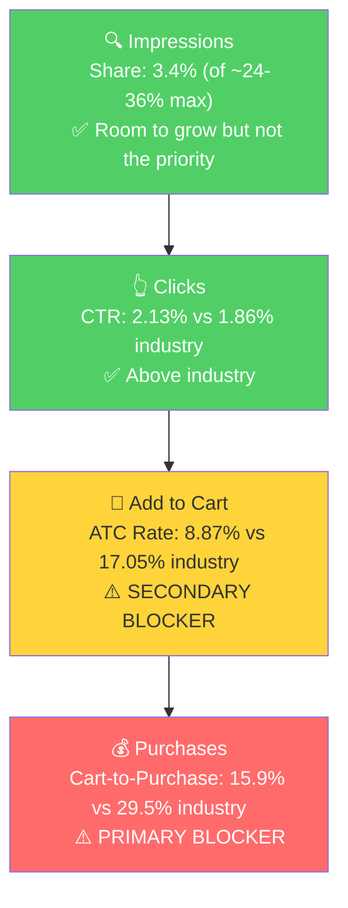

# SQP Analysis: P0 - SMARTstock VR Gunstock (B0FJJNSWB8)

## Tagging Rationale

**Tier 1 (Hero):** Queries where the customer is searching for exactly a VR gun stock for Quest 3 or any current-gen headset. The product is the direct answer. Includes both "gunstock" and "gun stock" spelling variants.
- vr gun stock quest 3, vr gun stock, quest 3 gun stock, meta quest 3 gun stock, vr gunstock, vr gunstock quest 3, quest 3 gunstock, meta quest 3s gun stock, gun stock for meta quest 3, vr gun stock quest 3s, quest 3s gunstock

**Tier 2 (Core market):** Queries for VR gun stocks on older platforms (Quest 2, PSVR2) or generic "gun stock" terms. Same product intent but secondary platforms that are declining in user base.
- vr gun stock quest 2, quest 2 gun stock, oculus quest 2 gun stock, meta quest 2 gun stock, vr gunstock quest 2, gun stock, psvr2 gun stock, psvr 2 gunstock, gunstock

**Tier 3 (Broad/adjacent):** Queries where the customer may or may not want a gunstock specifically. "VR gun" could mean gun controllers, toy guns, or gunstocks. "Meta quest 3 accessories" is a massive keyword but the product competes against headstraps, cases, and controllers.
- vr gun, meta quest 3 accessories, quest 3 accessories

**Branded:** istock vr gunstock, istock, skol vr gunstock, istock vr (noted for context, not analyzed as a growth tier)

**Catalog Overlap Check:** iSTOCK has 3-4 gunstock products that could rank on the same queries (SMARTstock, iSTOCK VR Gunstock, iSTOCK PRO, Armory-R1). All are Quest-compatible gunstocks. Adjusted impression share cap for Tier 1 and Tier 2: ~24-36% (3-4 products).

## Market Sizing (12-month average, Apr 2025 - Mar 2026)

| Tier | Monthly Search Volume | Monthly Add to Carts (Market) | Monthly Purchases (Market) | Est. Market Size ($/mo) |
|------|----------------------|-------------------------------|---------------------------|------------------------|
| Tier 1 | 22,908 | 1,562 | 491 | $93,720 |
| Tier 2 | 8,403 | 553 | 158 | $33,180 |
| Tier 3 | 89,777 | 8,959 | 1,832 | $537,540 |
| **Total P0** | **121,088** | **11,074** | **2,481** | **$664,440** |

*Estimated using $60 avg product price based on competitive landscape analysis.*

**Note on Tier 3:** The market size is large because "meta quest 3 accessories" is a massive category keyword (~80K-260K monthly searches). However, iSTOCK has zero cart adds and zero purchases from Tier 3 queries across the entire 3-month recent window. A VR gunstock is a niche accessory that does not organically surface for these broad searches. Tier 3 market size overstates the capturable opportunity.

**Seasonality:** Tier 1 search volume shows a clear Q4 spike: Nov 27K, Dec 47K vs. a baseline of ~16-24K in other months. This aligns with the P0 annual trend from Step 1 (Dec sales 2x at $3,599). VR headsets are holiday gifts, and gunstock accessories follow the same cycle.

## Market Share and Potential (Jan - Mar 2026)

| Tier | Impression Share | Click Share | Cart Share | Purchase Share | Trend |
|------|-----------------|-------------|------------|---------------|-------|
| Tier 1 | 3.4% | 3.9% | 1.9% | 1.0% | Purchase share declining (1.5% > 1.2% > 0.3%) |
| Tier 2 | 4.7% | 4.9% | 2.8% | 2.2% | Purchase share dropped to 0% in March |
| Tier 3 | 0.06% | 0.07% | 0% | 0% | Invisible, no meaningful presence |

Key observations:
- **The funnel narrows dramatically from clicks to purchases.** On Tier 1, click share is 3.9% but purchase share is only 1.0%. The brand gets clicked but doesn't convert.
- **March was catastrophic.** Purchase share on Tier 1 dropped to 0.28% (1 purchase) and Tier 2 dropped to 0% (zero purchases). This directly correlates with the buy box crash to 66% identified in Step 1.
- Tier 3 is essentially uncapturable. The brand is invisible on broad accessory queries and this is expected for a niche product.

## Blockers & Growth Path

**Volume-weighted brand vs industry rates (Jan - Mar 2026):**

Tier 1:
- Brand CTR: 2.13% vs Industry CTR: 1.86% (healthy, above industry)
- Brand ATC rate: 8.87% vs Industry ATC rate: 17.05% (48% below industry)
- Brand CVR: 1.41% vs Industry CVR: 5.03% (72% below industry)
- Brand Cart-to-Purchase: 15.9% vs Industry: 29.5% (46% below)

Tier 2:
- Brand CTR: 1.69% vs Industry CTR: 1.61% (healthy, above industry)
- Brand ATC rate: 9.80% vs Industry ATC rate: 17.36% (44% below industry)
- Brand CVR: 2.31% vs Industry CVR: 4.65% (50% below industry)

| Tier | Impression Share | CTR (Brand vs Industry) | CVR (Brand vs Industry) | Primary Blocker | Growth Path |
|------|-----------------|------------------------|------------------------|-----------------|-------------|
| Tier 1 | 3.4% (of ~24-36% max) | 2.13% vs 1.86% (Healthy) | 1.41% vs 5.03% (Blocker) | CVR | Fix listing first (no reviews, no A+, no video, buy box broken), then scale PPC. Sending more traffic with 72% below-industry CVR burns money. |
| Tier 2 | 4.7% (of ~24-36% max) | 1.69% vs 1.61% (Healthy) | 2.31% vs 4.65% (Blocker) | CVR | Same as Tier 1. CVR improvements on the listing benefit all tiers simultaneously. |
| Tier 3 | 0.06% (of ~8-9% max) | N/A (too few clicks) | N/A | Not capturable | The product simply does not compete for broad "quest 3 accessories" queries. Skip. |

- **CVR blocker breakdown:** The funnel leaks at both the ATC stage and the Cart-to-Purchase stage. Shoppers click (CTR is fine) but don't add to cart (ATC rate 48% below industry), and those who do add to cart don't complete the purchase (Cart-to-Purchase 46% below). The ATC drop points to listing content issues (no A+, no video, no reviews to build confidence). The Cart-to-Purchase drop points to the buy box problem (customer adds to cart but the buy box is lost, so the cart checkout experience may be disrupted or the price shown is from another seller).

## Insights

- P0 (SMARTstock VR Gunstock) has a healthy CTR across both tiers (above industry), meaning the main image and title work well on the search results page. The problem is entirely post-click: shoppers land on the listing and don't convert.
- The VR gunstock market is seasonal with a 2-3x Q4 peak (Dec search volume 47K vs. baseline ~16-24K). This means any CVR fix implemented before Q4 2026 will compound with natural volume growth during the holiday season.
- Branded search volume is small but meaningful for a niche brand. "istock vr gunstock" converts at a 7.5% purchase rate (55 purchases from 732 clicks over 17 months), confirming the product satisfies when customers specifically seek it out. The problem is non-branded conversion.

## Things to Investigate Further

- The Cart-to-Purchase drop (15.9% vs 29.5% industry) needs to be cross-referenced with the buy box data. If the buy box was healthy before March, check whether Cart-to-Purchase was also healthier in Jan-Feb vs March to confirm the buy box is the root cause of that specific drop.
- Impression share on Tier 1 is only 3.4% despite 3-4 products being eligible to rank. Check in ad data whether the brand is bidding on Tier 1 keywords or relying entirely on organic ranking.

## Questions for the Seller

- No additional questions beyond those already raised in Steps 1 and 2 (buy box root cause, review strategy, brand name consolidation).
