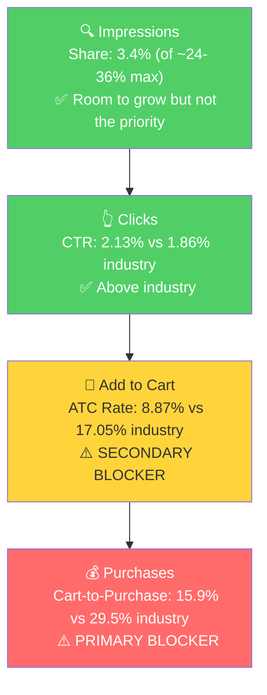

# Seller Central Audit: iSTOCK VR

## Section 1: Catalog Assessment

| Priority | Product | 3-Mo Sales | 3-Mo Ad Spend | ROAS | TACoS | Organic Sales | Ad Sales % | Buy Box % | CVR | Trend |
|----------|---------|-----------|--------------|------|-------|---------------|-----------|-----------|-----|-------|
| P0 | SMARTstock VR Gunstock (B0FJJNSWB8) | $5,339 | $349 | 4.43 | 6.5% | $3,459 | 35.2% | 99%+ (child) | 3.67% | Flat |
| P1 | iSTOCK VR Gunstock (B0DXHJ47Z1) | $2,129 | $417 | 2.69 | 19.6% | $1,009 | 52.7% | 100% (child) | 3.55% | Declining |
| P2 | iSTOCK PRO VR Gunstock (B0F9BJKX9J) | $1,660 | $268 | 2.92 | 16.1% | $895 | 46.2% | 99.3% | 3.31% | Declining |
| P3 | B0F4ZJFQMW (Armory-R1) | $405 | $0 | - | - | $405 | 0% | 95.8% | 1.37% | Growing |

**Not prioritized:** PSVR2 Gunstock ($63, declining to zero), ARC VR Sword ($160, new launch), plus several small/dead products (pickleball t-shirts, watering can, dice tower, card game). The catalog is scattered across unrelated categories beyond the core VR gunstock line.

## Section 2: Qualitative Product Understanding (P0)

**Product:**
- A two-handed VR gunstock that connects two Meta Quest controllers in a rifle configuration for VR shooting games (Contractors, Pavlov, Onward)
- Key features: Ultra-lightweight (~6 oz), non-magnetic snap-in connection system, adjustable buttstock with cheek rest option, PLA Plus material, compatible with Quest 1/2/3/3S/Pro/Rift S
- Solves: Aiming instability when holding two separate controllers mid-air. A gunstock locks them into a stable rifle form, improving accuracy and immersion
- Purchase motivation: Competitive advantage in VR FPS games. Trusted by esports athletes in VR leagues (VREL, IVRL, VRML)

**Customer:**
- VR FPS gamers, primarily Meta Quest owners. Male-skewing, 18-35, tech-savvy
- Range from casual players wanting immersion to competitive esports players seeking precision

**Brand:**
- Registered brand with real identity. Sells via istockgaming.com (Shopify), skolvr.com, Etsy, Walmart, and Amazon
- Active community: Discord, YouTube, affiliate program (10% commission)
- Brand vibe: Tactical/military aesthetic. Listing images use composite battlefield backgrounds, models in military gear
- Multiple brand names in use: "iStock" (Amazon brand), "SMARTstock" (product sub-brand), "SKOLVR" (DTC site). This creates confusion for shoppers and dilutes brand recognition

**Competitive Landscape:**
- **Price positioning:** Avg mid-range VR gunstock: ~$50-65. P0 price: ~$60. In line with mid-range competitors.

| Competitor | Product | Approx. Price | Key Differentiator |
|-----------|---------|--------------|-------------------|
| ProTubeVR | MagTube | $100-130 | Premium magnetic system, modular, market leader |
| BeswinVR | Various models | $40-65 | Established Amazon presence, multiple form factors |
| AMVR | VR Gun Stock | $25-40 | Budget option, high review count |
| Kobra VR | Kobra Stock | $50-70 | Mid-range, magnetic attachment |

- P0's differentiation is the non-magnetic connection system and ultra-light weight. It competes directly with BeswinVR and Kobra on price. The challenge is competing against AMVR's review count at the budget end and ProTubeVR's brand equity at the premium end.

**Listing Quality:**

**Strengths:**
- Strong image set (8 total) with lifestyle shots, feature callouts, weight demonstration, and assembly guide
- Good title keyword coverage (164 chars, includes all major compatibility terms)
- All 5 bullet slots used, each addressing a distinct selling point

**Opportunities:**
- **No reviews/ratings.** This is the single biggest conversion barrier. Competitors like AMVR have hundreds of reviews. With 30 units/month for 8+ months, the lack of social proof is critical.
- **No A+ content.** A $60 considered purchase needs comparison modules, game compatibility details, and close-up build quality images on the PDP.
- **No video.** The product's core value prop (non-magnetic snap-in, quick reload) is nearly impossible to understand from static images. A demo video would directly address purchase hesitation.
- **Emoji-formatted bullets** look unprofessional and waste character space on Amazon.
- **Brand name confusion** across listing elements (iStock brand, SMARTstock title, SKOLVR images).

## Section 3: Quantitative Product Understanding (P0)

**Annual Trend:**

| Metric | Aug 2025 (Launch) | Dec 2025 (Peak) | Jan 2026 | Feb 2026 | Mar 2026 |
|--------|---------|----------------|---------|---------|---------|
| Total Sales | $820 | $3,599 | $1,800 | $1,860 | $1,680 |
| Sessions | 794 | 1,338 | 699 | 841 | 989 |
| CVR | 1.89% | 4.48% | 4.29% | 3.69% | 3.03% |
| Buy Box % | 99%+ | 99%+ | 99%+ | 99%+ | 99%+ |

*Note: Parent-level buy box appeared to drop to 66% due to FBM child SKUs with 0% buy box diluting the average. At the child level, the actual selling children (Right Hand, Left Hand) maintain 99-100% buy box throughout. No buy box issue exists.*

- Product launched Aug 2025, scaled rapidly to a $3,599 December peak, then stabilized at ~$1,700-1,860/mo. This is healthy growth for a niche VR accessory.
- **CVR is declining** (4.29% to 3.03% over Jan-Mar) while sessions are growing (699 to 989). This points to a listing content and social proof problem, not a traffic or buy box issue. The product gets more visitors each month but converts fewer of them.
- Ad spend started in January 2026 ($15) and ramped to $208 in March. Before that, all sales were organic.

**Sales Rank Trajectory:** Volatile but improving. Went from #558 (Sep 2025) to fluctuating between #150-370 since Oct 2025. Currently #257 in VR Standalone Hardware Accessories.

## Section 4: Market Opportunity (SQP)

**Tier Breakdown:**

- **Tier 1 (Hero):**
  - **Keywords:** vr gun stock quest 3, vr gun stock, quest 3 gun stock, meta quest 3 gun stock, vr gunstock, vr gunstock quest 3, quest 3 gunstock, meta quest 3s gun stock, gun stock for meta quest 3, vr gun stock quest 3s, quest 3s gunstock
  - **Rationale:** Queries where the customer is searching for exactly a VR gunstock for Quest 3 or current-gen headsets. Highest purchase intent.

- **Tier 2 (Core market):**
  - **Keywords:** vr gun stock quest 2, quest 2 gun stock, oculus quest 2 gun stock, meta quest 2 gun stock, vr gunstock quest 2, gun stock, psvr2 gun stock, psvr 2 gunstock, gunstock
  - **Rationale:** VR gunstock queries for older platforms (Quest 2, PSVR2) or generic "gun stock" terms. Same product intent but secondary platforms.

- **Tier 3 (Broad/adjacent):**
  - **Keywords:** vr gun, meta quest 3 accessories, quest 3 accessories
  - **Rationale:** Broad queries where the customer may not be specifically looking for a gunstock. Massive volume but the product competes against headstraps, cases, and controllers.

**Market Sizing:**

| Tier | Monthly Search Volume | Monthly Add to Carts (Market) | Monthly Purchases (Market) | Est. Market Size ($/mo) |
|------|----------------------|-------------------------------|---------------------------|------------------------|
| Tier 1 | 22,908 | 1,562 | 491 | $93,720 |
| Tier 2 | 8,403 | 553 | 158 | $33,180 |
| Tier 3 | 89,777 | 8,959 | 1,832 | $537,540 |
| **Total P0** | **121,088** | **11,074** | **2,481** | **$664,440** |

*Estimated using $60 avg product price based on competitive landscape analysis.*

Note: Tier 3 overstates capturable opportunity. The brand has zero cart adds and zero purchases from these broad queries. The realistic addressable market is Tier 1 + Tier 2: ~$127K/mo.

**Blockers & Growth Path:**

| Tier | Impression Share | CTR (Brand vs Industry) | CVR (Brand vs Industry) | Primary Blocker | Growth Path |
|------|-----------------|------------------------|------------------------|-----------------|-------------|
| Tier 1 | 3.4% (of ~24-36% max) | 2.13% vs 1.86% (Healthy) | 1.41% vs 5.03% (72% below) | CVR | Fix listing first (reviews, A+, video), then scale PPC |
| Tier 2 | 4.7% (of ~24-36% max) | 1.69% vs 1.61% (Healthy) | 2.31% vs 4.65% (50% below) | CVR | Same as Tier 1. Listing improvements benefit all tiers. |
| Tier 3 | 0.06% | N/A | N/A | Not capturable | Skip. Product doesn't compete on broad accessory queries. |

**ICAP Funnel Visual (Tier 1):**

- **CTR is above industry across both tiers.** The main image and title work. Shoppers click. The problem is entirely post-click.
- **CVR leaks at two stages:** ATC rate is 48% below industry (shoppers click but don't add to cart = listing content issue, no reviews, no A+, no video), and Cart-to-Purchase is 46% below industry (shoppers add to cart but abandon before purchasing, likely due to lack of social proof and competitor comparison).
- **March purchase share dropped** to 0.28% on Tier 1 (1 purchase) and 0% on Tier 2, reflecting the ongoing CVR weakness.

## Section 5: Ad Analysis

### Account Level

**Campaign Structure**

The 3 enabled manual campaigns are well-structured with clean Exact + Phrase separation. No overstuffing. ROAS ranges from 4.32 to 4.69. The seller understands campaign architecture.

**Auto vs Manual Split**

| Targeting Type | Clicks | Spend | Sales | ROAS | AOV | CPC | CVR |
|----------------|--------|-------|-------|------|-----|-----|-----|
| Manual | 480 | $168.49 | $749.81 | 4.45 | $39.46 | $0.35 | 3.96% |
| Automatic | 27 | $10.68 | $0.00 | 0.00 | - | $0.40 | 0.0% |

Manual drives 100% of sales. Auto spend is minimal and entirely wasted on a non-VR product (pickleball t-shirts). The main auto campaign "ALL AUTO" was recently paused, reason unknown.

**Campaign Profitability**

All manual campaigns are profitable. The only unprofitable spend is "T-Shirts | Auto" ($10.20, 0 orders). Pause immediately.

**Targeting Strategy**

**Keyword vs Product Targeting:**

| Targeting Strategy | Clicks | Spend | Sales | ROAS | AOV | CPC | CVR |
|-------------------|--------|-------|-------|------|-----|-----|-----|
| Keyword Targeting | 2,833 | $1,024.20 | $3,885.97 | 3.79 | $38.47 | $0.36 | 3.57% |
| Product Targeting | 490 | $216.36 | $354.90 | 1.64 | $39.43 | $0.44 | 1.84% |

Keyword targeting outperforms product targeting at 3.79 vs 1.64 ROAS with nearly double the CVR. Product targeting should be monitored. Most of the PT spend is from now-paused campaigns.

**Match Type Breakdown:**

| Match Type | Clicks | Spend | Sales | ROAS | AOV | CPC | CVR |
|------------|--------|-------|-------|------|-----|-----|-----|
| EXACT | 235 | $115.77 | $499.86 | 4.32 | $35.70 | $0.49 | 5.96% |
| PHRASE | 799 | $318.47 | $1,274.68 | 4.00 | $41.12 | $0.40 | 3.88% |

Healthy split. Exact has the highest CVR (5.96%) and best ROAS (4.32) as expected. No broad match is used.

### Product Level (P0)

**P0 Campaign Map**

| Campaign | Spend | Sales | ROAS | Clicks | Orders |
|----------|-------|-------|------|--------|--------|
| iSTOCK VR Gunstock - Exact KW'S | $30.60 | $179.97 | 5.88 | 47 | 3 |
| iSTOCK VR Gunstock \| New Phrase | $32.03 | $179.97 | 5.62 | 149 | 3 |
| Catch All iStock - Exact | $7.63 | $0.00 | 0.00 | 21 | 0 |
| **Total P0 (enabled)** | **$70.26** | **$359.94** | **5.12** | **217** | **6** |

P0 gets 39% of enabled ad spend. ROAS of 5.12 is above account average. The product converts well through ads when it does convert, but at very low volumes (6 orders from 217 clicks = 2.76% CVR).

**CVR Blocker: Non-Branded vs Branded Conversion**

Section 4 identified CVR as the primary blocker. The ad data confirms it through the branded vs non-branded conversion gap:

| Search Term Type | Spend | Clicks | Orders | CVR | ROAS |
|-----------------|-------|--------|--------|-----|------|
| Non-branded Tier 1/2 keywords | $248.93 | 719 | 16 | 2.22% | 3.21 |
| Branded keywords (istock, skol) | $70.82 | 121 | 12 | 9.92% | 7.90 |

Non-branded shoppers convert at 2.22%. Branded shoppers convert at 9.92%. That is a 4.5x gap. The product works, people who know it buy it. New shoppers don't have enough confidence. Buy box is healthy at the child level (99-100%), so this gap is entirely a listing content and social proof problem.

**CVR Blocker: Placement Opportunity**

> **Finding: Top of Search converts 2.7x better than Product Pages but gets only 21% of spend**
>
> **Problem:**
> - Top of Search: 6.19% CVR, 4.57 ROAS, 8.86% CTR
> - Product Pages: 2.31% CVR, 2.74 ROAS, 0.70% CTR
> - Top of Search gets $254.94 (21% of spend) while Product Pages get $329.18 (27%)
>
> **Solution:**
> - Increase Top of Search bid modifier on manual campaigns
> - This partially mitigates the CVR blocker by placing the product in the highest-converting position
>
> **Impact:**
> - Shifting $100 from Product Pages to Top of Search: ~$183 in additional sales from the same budget (4.57 vs 2.74 ROAS on that $100)

**PSVR2 Gunstock: Cross-Product Waste**

> **Finding: PSVR2 Gunstock (B0CVJ53357) is bleeding spend across 6 campaigns**
>
> **Problem:**
> - Total spend across all campaigns: ~$66, total sales: $20.99 (0.32 ROAS)
> - This product has $0 revenue from Seller Analytics in Feb and Mar
>
> **Solution:** Remove PSVR2 as an advertised product from all campaigns.
>
> **Impact:** $66 recovered. At 4.45 ROAS, this yields ~$294 in additional sales if redirected to profitable products.

## Section 6: Action Plan

The primary blocker is CVR. The product shows up and gets clicked at or above industry rates, but fails to convert because: (1) no reviews/social proof, (2) no A+ content or video. Buy box is healthy at the child level (99-100%), so this is purely a listing content problem. The action plan sequences listing fixes first to improve CVR, then scales PPC once the product converts better. Sending more traffic with 72% below-industry CVR would waste budget.

### Weeks 1-2: Immediate Actions

**PPC Quick Wins**
- Pause "T-Shirts | Auto" campaign ($10.20 wasted)
- Remove PSVR2 Gunstock (B0CVJ53357) as advertised product from all campaigns ($66 in wasted spend recovered)
- Increase Top of Search bid modifier on "iSTOCK VR Gunstock - Exact KW'S" and "iSTOCK VR Gunstock | New Phrase" campaigns to shift spend toward the 6.19% CVR placement

**Review Generation**
- Enroll P0 in Amazon Vine program to accelerate review acquisition
- Activate Request-a-Review on all P0 orders from the past 30 days
- Target: 15-20 reviews within 4-6 weeks to establish social proof baseline

### Weeks 2-4: Short-Term Optimizations

**Listing Content Preparation**
- Script and produce a 30-60 second product demo video showing: controller snap-in, aiming in-game, quick reload motion, weight comparison
- Design A+ content modules: comparison table (SMARTstock vs magnetic gunstocks), game compatibility showcase, build quality close-ups, setup guide
- Rewrite bullet points: remove emojis, lead with concrete benefits, add relevant search keywords

**PPC Monitoring**
- Track CVR on Tier 1 keywords week-over-week as reviews accumulate
- Consider reactivating the paused "ALL AUTO" campaign which had 5.80 ROAS on P0, once reviews begin to build

### Weeks 4-6: Medium-Term Growth

**Publish Listing Improvements**
- Upload video to P0 listing
- Publish A+ content
- Update bullet points
- Monitor CVR impact (expect 1-2 week lag before metrics stabilize)

**Brand Consistency**
- Consolidate brand messaging: align "iStock," "SMARTstock," and "SKOLVR" references across the listing, A+ content, and brand store

**PPC Scaling (conditional on CVR improvement)**
- If CVR improves to >4% (from current 2.2% on non-branded terms), begin scaling Tier 1 keyword spend
- Add broad match campaigns for keyword discovery on VR gunstock terms
- Re-evaluate product targeting strategy (currently 1.64 ROAS, may improve with better listing)

### Weeks 6-8: Scaling and Evaluation

**PPC Scaling**
- Scale manual campaigns on Tier 1 keywords that are converting above 3.5% CVR
- Launch branded defense campaign on "istock vr gunstock" and "skol vr gunstock" (currently converting at 12-19% CVR, worth protecting)
- Evaluate Tier 2 (Quest 2) keyword performance and scale if CVR is healthy

**Catalog Assessment**
- Evaluate P1 (iSTOCK VR Gunstock) and P2 (iSTOCK PRO) for similar CVR improvements
- P1 buy box is healthy at child level (100%). Same listing improvements apply
- Consider whether P3 (Armory-R1) warrants ad investment based on its organic growth trajectory

**Seasonal Preparation**
- VR gunstock search volume peaks 2-3x in Nov/Dec (holiday VR headset gifting). With CVR improvements in place by September, the brand is positioned to capture significantly more of the Q4 surge than it did in 2025

## Section 7: Insights & Questions for the Seller

**Insights:**
- P0 (SMARTstock VR Gunstock) is a strong product in a niche but growing market. It launched 8 months ago, scaled to $1,800/mo organically, and converts above industry CTR. The growth constraint is entirely on the product detail page: no reviews, no A+ content, no video.
- The branded vs non-branded CVR gap (9.92% vs 2.22%) proves the product satisfies customers who know it. The opportunity is closing that gap for non-branded discovery traffic, which represents a $127K/mo addressable market (Tier 1 + Tier 2).
- The ad account is well-managed. Campaign structure is clean, ROAS is healthy (4.32-4.69), CPCs are low ($0.35-0.49). The limiting factor is not ad management, it is the product's ability to convert non-branded traffic.
- Buy box is healthy at the child level (99-100% on all selling children). The parent-level drop to 66% is caused by FBM child SKUs with 0% buy box diluting the average. This is not a real issue.

**Questions for the Seller:**
- The product has been selling 30 units/month since launch but appears to have very few reviews. Are you using any review generation strategies (Vine, request-a-review, insert cards)?
- Several campaigns were recently paused (ALL AUTO, VR GunStock - Phrase, VR GunStock - PT). What prompted this?
- You sell under multiple brand names: "iStock" on Amazon, "SMARTstock" in the title, "SKOLVR" on the DTC site. Is there a strategic reason, or would consolidating be possible?
- P2 (iSTOCK PRO VR Gunstock) sales dropped from $1,065 in January to ~$280 in February. Was this a stockout, intentional change, or something else?
